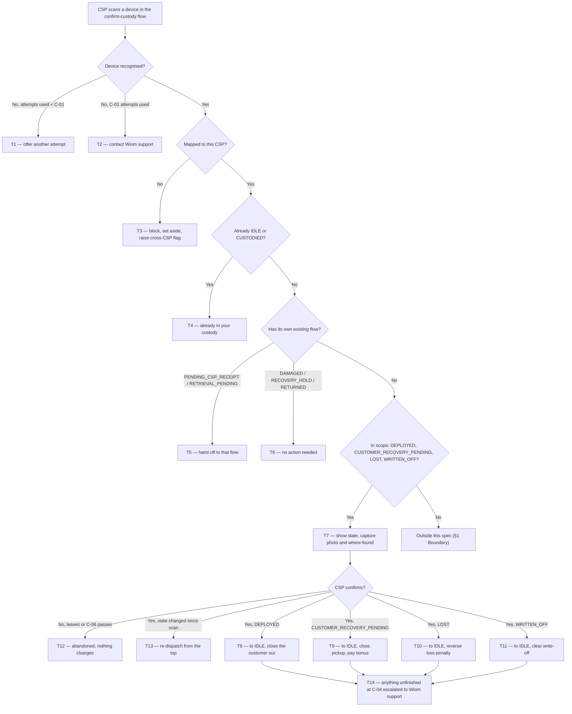

# Confirm Device Custody — CSP declares what it physically holds

*Scan a device, get it back into usable stock.*

| | | | |
|---|---|---|---|
| **Owner** — Jaivin Prajapati (PM) | **Reviewer** — [Eng lead — TBD] ⚠️ *AI GENERATED — review* | **Status** — Draft | **Sign-off** — Pending |
| **Version** — v0.1 · 2026-07-26 | **Consulted — CSP App** — [name] ⚠️ *AI GENERATED — review* | **Consulted — Device custody (ACS)** — [name] ⚠️ *AI GENERATED — review* | **Consulted — Payments/Settlement** — [name] ⚠️ *AI GENERATED — review* |

> **ID system:** Gn guardrails (§1) · Mn metrics (§1) · Rn rules with lettered obligations (§2) · Tn transitions (§3b, canon) · C-nn config (§5) · MQ-n measurement (§6) · AC-GROUP-n acceptance criteria (§7).
>
> **Reading contract:** §3b is canon — if any statement disagrees with it, §3b wins, except dispatch order, which the §3a chart and its precedence rules own. Every fact has one home; every other mention is an ID reference. Every number outside §5 is a C-id, except concrete example data in §7 and §1 baselines. Failure behaviour is stated as a customer-visible envelope with a C-id window; how recovery is attempted inside that window is the implementer's. This document states **what and why** — decomposition, schema, storage, retries and instrumentation belong to the implementer.

---

## 1. Objective & Definition of Success

**Objective.** A CSP who is physically holding a device that Wiom's records place somewhere else can scan it, declare it, and have it back in their usable stock the same minute — with any penalty they were charged for losing it reversed.

**Boundary.** This spec governs a CSP confirming custody of **a device already mapped to that CSP**, from four starting states: with a customer (DEPLOYED), awaiting recovery from a customer (CUSTOMER_RECOVERY_PENDING), LOST, and WRITTEN_OFF. Every accepted confirmation ends at IDLE.

It **leaves unchanged**:
- **Confirming receipt** of a device awaiting receipt (PENDING_CSP_RECEIPT), and **cancelling a return** for a device awaiting return (RETRIEVAL_PENDING) — the scan hands off to those existing flows and does not duplicate them (AC-REG-1).
- The **loss and write-off penalty pipelines themselves** — how a penalty is calculated and charged is untouched; this spec only reverses one (AC-REG-2).
- The **recharge lock and customer refund-eligibility signal**, which the *Netbox Pickup — Customer-Driven Creation & Recharge Lock* PRD already owns and keys on a device reaching IDLE (its G2 and G4). Confirmations here reach IDLE, so those promises apply unchanged; this spec adds no new customer-facing money rule (AC-REG-3).
- **Scanner accuracy logging**, governed by the *Scanner Accuracy Logging* PRD. That spec logs every OCR read attempt for scanner quality. This spec's record-keeping (R12) is a separate, business-outcome record. A scan that matches nothing produces no record *here* (R12 MUST NOT a) while still producing a scanner-accuracy row *there* — the two are not in conflict (AC-REG-4).

It explicitly **excludes**:
- **Cross-CSP movement.** A device mapped to a different CSP is never transitioned by this feature. It is stopped and flagged (G1). Moving custody between CSPs is deferred to a separate spec; the flags raised here are that spec's evidence base (MQ-3).
- **Charging the write-off correctly.** A separate spec fixes the forward charge. This spec only reverses.
- **Any customer handshake.** V1 confirms a DEPLOYED device on the CSP's word alone and raises a review flag (R7c). A customer OTP handshake before that transition is **deferred to V2**, consciously, to avoid a customer-side dependency in V1.

### Guardrails — promises that hold on every path

| ID | Guardrail | One line | Anchors |
|---|---|---|---|
| G1 | **Own devices only** | A CSP can only confirm a device already mapped to them; one mapped to another CSP is never changed, always flagged. | R3a · R3b · AC-BLOCK-1 · AC-GRD-1 · MQ-3 |
| G2 | **One destination** | Every accepted confirmation ends with the device IDLE under the confirming CSP, whatever state it started in. | R7 · R8 · R9 · R10 · AC-GRD-2 · MQ-2 |
| G3 | **No penalty left standing** | A recovered device leaves the CSP owing nothing for it: money actually taken is returned, and a liability recorded but never charged is cleared off the record. | R9a · R10a · AC-GRD-3 · MQ-4 |
| G4 | **Never more than was taken** | A reversal returns at most what was charged, never runs twice for the same penalty, and never returns money that was never collected. | R9 MUST NOT(b) · R8 MUST NOT(a) · R10 MUST NOT(b) · AC-DUP-2 · AC-GRD-4 · AC-WOFF-2 · MQ-4 |
| G5 | **Every idle transition is announced** | Every confirmation that lands a device in IDLE tells the customer system — all four source states, never only the pickup-and-recovery path. | R11a · R11 MUST NOT(a) · R11 MUST NOT(b) · AC-GRD-5 · AC-GRD-6 · MQ-6 |

### Success metrics

| ID | Metric | Baseline | Target | Source |
|---|---|---|---|---|
| M1 | Support tickets raised by CSPs to get a device state corrected by hand. | [to be measured from support ticket data before launch] ⚠️ *AI GENERATED — review* | −50% within 3 months ⚠️ *AI GENERATED — review* | MQ-1 |

**Invariant (not a metric):** **G1** devices transitioned for a CSP they are not mapped to = **0**, zero tolerance. Monitored via MQ-3.
**Invariant (not a metric):** **G4** penalties reversed more than once, or reversed for more than was charged = **0**, zero tolerance. Monitored via MQ-4.

---

## 2. User Stories & Rules

| ID | Story | MUST | MUST NOT |
|---|---|---|---|
| R1 | As a CSP, I have a device in my custody that Wiom's records place somewhere else, and I want to confirm it is with me. | **(a)** Match the device I present against the devices mapped to me. **(b)** Show me the device's current state before asking me to confirm anything. **(c)** Return that result within C-05 of the scan. | Let me confirm before I have been shown the device's current state. |
| R2 | As a CSP, when the system cannot find the device I am holding, I want to be told what to do next. | **(a)** Allow me C-01 attempts in one sitting. **(b)** After the last one, tell me to contact Wiom support. | **(a)** Offer me more than C-01 attempts. **(b)** Create a custody record for a scan that matched no device. |
| R3 | As Wiom, I want a claim on another CSP's device stopped and visible, because devices moving quietly is how stock goes missing. | **(a)** Stop, and tell the CSP to put the device aside and contact Wiom support. **(b)** Raise a cross-CSP flag and record the event. | **(a)** Offer the CSP any way to confirm it. **(b)** Change anything at all about the device. |
| R4 | As a CSP, when the device is already in my stock, I want to be told that plainly. | **(a)** Tell me the device is already in my custody. **(b)** Record the scan. | Change the device's state. |
| R5 | As a CSP, when the device already has its own process, I want to be sent there instead. | **(a)** A device awaiting my receipt (PENDING_CSP_RECEIPT) opens the existing confirm-receipt flow. **(b)** A device awaiting return (RETRIEVAL_PENDING) opens the existing cancel-return flow. **(c)** A device that is DAMAGED, on recovery hold (RECOVERY_HOLD), or already RETURNED tells me no action is needed and to contact support if I am holding it. | Confirm custody from any of these states. |
| R6 | As Wiom, I want a record of what the CSP was actually holding, so a reversal can be checked later. | **(a)** Capture a photo as part of the scan, without a separate step. **(b)** Take a free-text note of where the CSP found the device. The note is **required** — a confirmation cannot be submitted without it. | **(a)** Make the CSP choose from a fixed list of reasons — the note stays open text. **(b)** Accept a confirmation with an empty note. |
| R7 | As a CSP, I have taken a device back from a customer, and I want their service closed out properly so I am not chasing it later. | **(a)** Deactivate the connection, recorded as closed because the CSP confirmed custody. **(b)** Close the customer's active entitlement, cancel any open ISP recharge ticket, and close any open service complaint. **(c)** Raise a review flag, because a paying customer's service ended on the CSP's word alone. | Require anything from the customer in V1 — the OTP handshake is V2 (§1 Boundary). |
| R8 | As a CSP, I have recovered a device I was asked to collect, and I want the pickup closed and my bonus paid. | **(a)** Finalise the pending deactivation immediately, rather than leaving it to run down. **(b)** Close the pickup task as completed. **(c)** Pay the recovery bonus (C-03) where the existing eligibility rules are met. | Pay the recovery bonus twice for the same recovery (G4). |
| R9 | As a CSP, I have been charged for a device I have now found, and I want that charge undone. | **(a)** Reverse the loss penalty. **(b)** Where no money has been taken yet, cancel the charge outright so it is never taken. **(c)** Where money has been taken, log the reversal at the moment I confirm, and return it to the same pocket it came from by the end of the current recovery cycle (C-02). | **(a)** Take the money and give it back inside the same cycle. **(b)** Return more than was taken (G4). |
| R10 | As a CSP, my device was written off (WRITTEN_OFF), and I want it back in my stock with a clean record. | **(a)** Clear the recorded write-off liability immediately on confirmation, so the device returns to stock carrying nothing. No money was ever taken for a write-off (§8), so there is nothing to refund — this is a record clean-up, not a settlement. | **(a)** Hold the clearance to a cycle — with no cash movement there is nothing to settle (§5 C-02 note). **(b)** Raise a credit, payout or refund for a write-off — doing so would pay back money that was never collected. |
| R11 | As the customer system, I need to know when a device moves into the CSP's stock, so I stop selling service that cannot be delivered. | **(a)** Announce the transition to the customer system on **every** confirmation that lands a device in IDLE — DEPLOYED, awaiting customer recovery (CUSTOMER_RECOVERY_PENDING), LOST and written off (WRITTEN_OFF) alike. Sending the announcement is this spec's obligation; what the customer system does with it — the recharge lock and the refund-eligibility signal — is owned by the Netbox Pickup PRD (§1 Boundary). | **(a)** Skip the announcement for any source state — a LOST or WRITTEN_OFF device is announced exactly like one collected from a customer. **(b)** Make the announcement conditional on a pickup task, a complaint, a live connection or any other open record existing. |
| R12 | As Wiom, I want to be able to reconstruct any confirmation or block after the fact. | **(a)** Record every confirmation and every cross-CSP block with who scanned, when, the where-found note and the photo. | Require a record for a scan that matched no device (R2b). |

---

## 3. System Behaviour

### 3a. System flow chart

**Precedence — P1 (stale scan):** if the device's state changes between the scan and the confirmation, the state at the moment of confirmation wins. The confirmation is never applied to the state the CSP was shown; it is re-dispatched from the top of this chart (T13, AC-RACE-1).

**Precedence — P2 (ownership first):** the mapped-to-this-CSP check runs before any state check. A device mapped to another CSP is blocked even when its state is one of the four in scope (T3, AC-RACE-2).

### 3b. State transition table — canon

Lifecycle of a **custody confirmation** — created the moment a CSP scans a device inside this flow, ending when it is confirmed, abandoned or refused. The device's own state lifecycle is neighbouring: it appears here only as a side-effect. The customer's plan and connection lifecycles are out of scope and appear only where a confirmation closes them.

| ID | From | Action / Trigger | Rule / Check | To | Side-effects |
|---|---|---|---|---|---|
| T1 | — | CSP scans, device not recognised | Attempts used < C-01 | Scanned | Another attempt offered (R2a). No custody record written (R12 MUST NOT a). |
| T2 | Scanned | CSP's last allowed attempt fails | Attempts used = C-01 | Unresolved | CSP told to contact Wiom support (R2b). No custody record written (R2 MUST NOT b). |
| T3 | — | Scan matches a device mapped to a different CSP | — | Blocked | CSP told to set the device aside and contact support (R3a). Cross-CSP flag raised and the event recorded (R3b, R12a, G1). Device untouched (R3 MUST NOT b). Reviewed within C-07. |
| T4 | — | Scan matches my device, already IDLE or CUSTODIED | — | Already yours | CSP told the device is already in their custody (R4a). Scan recorded (R4b). Nothing changes (R4 MUST NOT). |
| T5 | — | Scan matches my device awaiting receipt (PENDING_CSP_RECEIPT), or awaiting return (RETRIEVAL_PENDING) | — | Handed off | The existing confirm-receipt or cancel-return flow opens (R5a, R5b). No confirm-custody action offered (R5 MUST NOT). |
| T6 | — | Scan matches my device that is DAMAGED, on recovery hold (RECOVERY_HOLD), or RETURNED | — | Not actionable | CSP told no action is needed, and to contact support if holding the device (R5c). Nothing changes. |
| T7 | — | Scan matches my device that is DEPLOYED, awaiting customer recovery (CUSTOMER_RECOVERY_PENDING), LOST or WRITTEN_OFF | — | Awaiting confirmation | Current state shown within C-05 (R1b, R1c). Photo captured by the scan (R6a). Where-found note taken (R6b). |
| T8 | Awaiting confirmation | CSP confirms | Source state = DEPLOYED | Confirmed | Device to IDLE (G2). Connection deactivated, recorded as closed because the CSP confirmed custody (R7a). Customer's active entitlement closed, any open ISP recharge ticket cancelled, any open service complaint closed (R7b). Review flag raised, reviewed within C-07 (R7c). Idle transition announced to the customer system (R11a, G5). Confirmation recorded (R12a). Cascade completes inside C-04. |
| T9 | Awaiting confirmation | CSP confirms | Source state = CUSTOMER_RECOVERY_PENDING | Confirmed | Device to IDLE (G2). Pending deactivation finalised at once, which closes the entitlement and any open complaint (R8a). Pickup task closed as completed (R8b). Recovery bonus C-03 paid where the existing eligibility rules are met, once only (R8c, G4). Idle transition announced to the customer system (R11a, G5). Confirmation recorded (R12a). Cascade completes inside C-04. |
| T10 | Awaiting confirmation | CSP confirms | Source state = LOST | Confirmed | Device to IDLE (G2). Connection closed out as in T8 where one is still open. Loss penalty reversed (R9a, G3): if no money has been taken, the charge is cancelled outright and never taken (R9b); if money has been taken, the reversal is logged now and the amount returns to the same pocket it came from by the end of the current C-02 cycle (R9c). The CSP's device exposure is restored. Idle transition announced to the customer system (R11a, G5). Confirmation recorded (R12a). |
| T11 | Awaiting confirmation | CSP confirms | Source state = WRITTEN_OFF | Confirmed | Device to IDLE (G2). Connection closed out as in T8 where one is still open. Recorded write-off liability cleared immediately, with no cycle wait (R10a, G3). No money was ever collected for the write-off, so nothing is credited and no pocket is touched (R10 MUST NOT(b), G4). The CSP's device exposure is restored. Idle transition announced to the customer system (R11a, G5). Confirmation recorded (R12a). |
| T12 | Awaiting confirmation | CSP leaves without confirming, or C-06 passes | — | Abandoned | Nothing changes. The device keeps its original state and any penalty stands. No record beyond the scan. ⚠️ *AI GENERATED — review* |
| T13 | Awaiting confirmation | CSP confirms, but the device's state changed since the scan | State at confirmation ≠ state shown | Scanned | The confirmation is not applied. The CSP is shown the new state and re-dispatched from the top of §3a (P1). |
| T14 | Confirmed | Part of the close-out has not completed by C-04 | — | Confirmed | The device is IDLE and the CSP has been told the confirmation succeeded — their part is done and is never reversed. Anything unfinished is escalated to Wiom support inside C-04 and resolved there. How completion is retried inside the window is the implementer's. ⚠️ *AI GENERATED — review* |

---

## 4. Screen Requirements

**Experience intent:** the CSP should feel the app believes them. A device in their hand becomes usable stock in one scan, and when it cannot, they are told exactly what to do instead — never left at a dead end.

**Master design file:** *Not yet created.* This spec goes to the design team; designs are added against these blocks. Flow and logic are settled here and are not re-opened at design time.

### Scan device — [design link pending]

**States:** ready (camera open, nothing read) · reading (frame captured, matching) · attempt failed (device not recognised, attempts remain — T1) · exhausted (C-01 attempts used — T2)
**Freshness:** match result within C-05 of a successful read

| Element | Source / Routes to | Logic |
|---|---|---|
| Action — scan device | T1–T7 via §3a | always available on entry |
| Field — attempts remaining | C-01 · computed | shown from the second attempt onward |
| Check — device recognised | — | drives the §3a first branch |
| Action — contact Wiom support | — | shown only in exhausted state (R2b) |

### Device found — confirm custody — [design link pending]

**States:** populated (device in an in-scope state — T7) · submitting (confirmation sent, not yet acknowledged) · changed (state moved since the scan — T13)
**Freshness:** state shown is as at the scan; re-checked at confirmation (P1)

| Element | Source / Routes to | Logic |
|---|---|---|
| Field — device id | device record | always shown |
| Field — current state, in plain words | device record | always shown before any action (R1b) |
| Field — what will happen | derived from source state (T8–T11) | states the consequence in plain words: the customer's service will end (DEPLOYED), the pickup will close (CUSTOMER_RECOVERY_PENDING), the penalty will be reversed (LOST, WRITTEN_OFF) |
| Field — penalty to be reversed | the charged penalty · C-02 | shown for LOST and WRITTEN_OFF devices only; where money was taken, shows when the credit lands (R9c) |
| Field — photo | captured by the scan (R6a) | shown as captured; no separate capture step |
| Field — where did you find it | free text (R6b) | open text, no options list (R6 MUST NOT) |
| Action — confirm custody | T8 / T9 / T10 / T11 via §3a | enabled only once the state has been shown (R1 MUST NOT) |
| Check — state re-check on confirm | T13 | on mismatch, replaces the screen with the new state (P1) |

### Outcome — confirmed — [design link pending]

**States:** success (device now IDLE) · success with credit pending (LOST or WRITTEN_OFF device where money was taken — T10)
**Freshness:** on completion of the confirmation

| Element | Source / Routes to | Logic |
|---|---|---|
| Field — device is now in your stock | T8–T11 | always shown on success (G2) |
| Field — credit status | C-02 | shown only where a charged penalty is being returned: states the amount and that it lands by the end of the current cycle (R9c, §5 interaction note) |
| Field — bonus paid | C-03 | shown only where the recovery bonus applied (R8c) |

### Outcome — device belongs to another CSP — [design link pending]

**States:** blocked (single state — T3)
**Freshness:** on scan result

| Element | Source / Routes to | Logic |
|---|---|---|
| Field — instruction | R3a | tells the CSP to put the device aside and contact Wiom support |
| Field — device id | device record | shown so the CSP can quote it to support |
| Action — contact Wiom support | — | always shown |
| Check — no confirm action | R3 MUST NOT(a) | no confirm control exists in this state |

### Outcome — no action needed — [design link pending]

**States:** already yours (IDLE or CUSTODIED — T4) · handed off (PENDING_CSP_RECEIPT or RETRIEVAL_PENDING — T5) · dormant (DAMAGED, RECOVERY_HOLD, RETURNED — T6)
**Freshness:** on scan result

| Element | Source / Routes to | Logic |
|---|---|---|
| Field — message | R4a / R5a / R5b / R5c | already-yours states the device is already in their custody; dormant states no action is needed and to contact support if holding it |
| Action — open the other flow | T5 | handed-off state only; opens confirm-receipt or cancel-return |

### Wiom support review queue (internal) — [design link pending]

**States:** open · reviewed
**Freshness:** a new flag appears within C-05 of being raised ⚠️ *AI GENERATED — review*

| Element | Source / Routes to | Logic |
|---|---|---|
| Field — flag type | T3 · T8 | cross-CSP block, or DEPLOYED-device confirmation |
| Field — device, CSP, time, where-found note, photo | R12a | always shown |
| Field — for cross-CSP flags, the CSP the device is mapped to | device record | cross-CSP flags only (R3b) |
| Field — age against C-07 | C-07 | flags past C-07 are surfaced first |

---

## 5. Configurability

| ID | Parameter | Default | Range | Who changes it |
|---|---|---|---|---|
| C-01 | Scan attempts allowed in one sitting before the CSP is sent to support (T1, T2, R2a) | 3 | Fixed in V1 | Product |
| C-02 | Recovery cycle that governs when a logged reversal returns money (T10, R9c) | 90 days | 1–365 days | PM + Engineering |
| C-03 | Recovery bonus on confirming a CUSTOMER_RECOVERY_PENDING device (T9, R8c) | ₹50 | Existing — unchanged by this spec | Product |
| C-04 | Close-out envelope: confirmation accepted → every downstream closure done, or escalated to Wiom support (T8, T9, T14) | 10 minutes ⚠️ *AI GENERATED — review* | 5–30 minutes | PM + Engineering |
| C-05 | Scan result shown to the CSP after a successful read (R1c, T7) | 5 seconds ⚠️ *AI GENERATED — review* | 3–10 seconds | Engineering |
| C-06 | How long an unconfirmed scan stays open before it lapses (T12) | 15 minutes ⚠️ *AI GENERATED — review* | 5–60 minutes | Product |
| C-07 | Review window for a cross-CSP flag or a DEPLOYED-device confirmation flag (T3, T8, R7c) | 2 working days ⚠️ *AI GENERATED — review* | 1–5 working days | Ops |

**Interaction note (C-04 × C-05):** C-05 is what the CSP waits for at the scan; C-04 is what happens after they confirm. The CSP is never held on screen for C-04 — the confirmation is acknowledged as soon as the device is IDLE, and any unfinished close-out is Wiom's problem, not theirs (T14).

**Interaction note (C-02 × confirmation):** between confirming a LOST or WRITTEN_OFF device and the C-02 cycle closing, the CSP must see the reversal as **approved, credit due by the cycle close date** — with the amount. This is the specified state between "penalty charged" and "money back". A WRITTEN_OFF device has no such gap: no money was taken, so there is nothing to credit and the clearance is immediate (R10a).

---

## 6. Measurement

| ID | The system must be able to answer… | Feeds |
|---|---|---|
| MQ-1 | How many support tickets CSPs raise to get a device state corrected by hand, before and after launch. | M1 |
| MQ-2 | How many confirmations happened, split by source state and outcome — and whether any ended anywhere other than IDLE. | G2 |
| MQ-3 | How many cross-CSP flags were raised, for which device and which pair of CSPs, and how many were reviewed inside C-07. | G1 invariant · R3b · the parked cross-CSP spec |
| MQ-4 | For every reversal: whether it was cancelled before charge, credited back, or cleared off the record with no cash movement; the amount; which pocket it landed in; whether it ever exceeded the original charge; and whether any penalty was reversed twice. Write-off clears must be distinguishable from cash reversals. | G3 · G4 invariant |
| MQ-5 | How many DEPLOYED-device confirmations were flagged, and how many were reviewed inside C-07. | R7c |
| MQ-6 | Whether the customer system was told, for every confirmation that reached IDLE, split by source state — so a gap on any one state is visible rather than averaged away. | G5 · R11a |
| MQ-7 | How many scans ended unresolved after C-01 attempts, and for which CSPs. | R2 |
| MQ-8 | How many confirmations still had close-out work outstanding at C-04, and what was outstanding. | T14 |

---

## 7. Acceptance Criteria

> Device ids, CSP ids, customer names, amounts and dates below are illustrative worked-example values, not real cases. ⚠️ *AI GENERATED — review*

### SCAN — Scanning and no match (T1, T2)

| AC | Given / When / Then | Verifies | Status |
|---|---|---|---|
| AC-SCAN-1 | **Given** CSP a0a0j6 opens confirm custody and scans a label the reader cannot resolve, **When** the first attempt fails, **Then** a second attempt is offered and no custody record exists for the scan. | R2a · R12 MUST NOT(a) · T1 | Settled |
| AC-SCAN-2 | **Given** the same CSP has used all C-01 (3) attempts without a match, **When** the third fails, **Then** no fourth attempt is offered and the CSP is told to contact Wiom support. | R2b · R2 MUST NOT(a) · T2 | Settled |
| AC-SCAN-3 | **Given** a scan session that ended unresolved at C-01, **When** the records are checked, **Then** no custody record was created for it — while the scanner-accuracy log still holds its OCR rows. | R2 MUST NOT(b) · T2 | Settled |

### BLOCK — Device mapped to another CSP (T3)

| AC | Given / When / Then | Verifies | Status |
|---|---|---|---|
| AC-BLOCK-1 | **Given** device GX41288 is mapped to CSP a0b5s4, **When** CSP a0a0j6 scans it, **Then** a0a0j6 is told to put it aside and contact Wiom support, no confirm action is offered anywhere on the screen, and GX41288's state, mapping and penalties are byte-for-byte unchanged. | R3a · R3 MUST NOT(a) · R3 MUST NOT(b) · T3 · G1 | Settled |
| AC-BLOCK-2 | **Given** the same scan, **When** it completes, **Then** a cross-CSP flag exists naming GX41288, scanning CSP a0a0j6, mapped CSP a0b5s4, the time, the where-found note and the photo — and it appears in the Wiom support review queue. | R3b · R12a · T3 · MQ-3 | Settled |

### OWNED — My device, no confirmation needed (T4, T5, T6)

| AC | Given / When / Then | Verifies | Status |
|---|---|---|---|
| AC-OWNED-1 | **Given** device GX77301 is IDLE under CSP a0a0j6, **When** a0a0j6 scans it, **Then** the CSP is told it is already in their custody, the scan is recorded, and the device's state is unchanged. | R4a · R4b · R4 MUST NOT · T4 | Settled |
| AC-OWNED-2 | **Given** device GX77302 is CUSTODIED under CSP a0a0j6, **When** a0a0j6 scans it, **Then** the same already-in-your-custody message is shown — CUSTODIED and IDLE behave identically here. | R4a · T4 | Settled |
| AC-OWNED-3 | **Given** device GX77303 is awaiting receipt (PENDING_CSP_RECEIPT) under CSP a0a0j6, **When** a0a0j6 scans it, **Then** the existing confirm-receipt flow opens and no confirm-custody action is offered. | R5a · R5 MUST NOT · T5 | Settled |
| AC-OWNED-4 | **Given** device GX77304 is awaiting return (RETRIEVAL_PENDING) under CSP a0a0j6, **When** a0a0j6 scans it, **Then** the existing cancel-return flow opens and no confirm-custody action is offered. | R5b · R5 MUST NOT · T5 | Settled |
| AC-OWNED-5 | **Given** device GX77305 is DAMAGED under CSP a0a0j6, **When** a0a0j6 scans it, **Then** the CSP is told no action is needed and to contact support if they are holding it, and nothing changes. | R5c · T6 | Settled |

### CONF — Reaching the confirmation screen (T7)

| AC | Given / When / Then | Verifies | Status |
|---|---|---|---|
| AC-CONF-1 | **Given** device GX79015 is LOST under CSP a0a0j6, **When** a0a0j6 scans it, **Then** the device's current state is shown within C-05 (5 s) before any confirm control becomes usable. | R1a · R1b · R1c · R1 MUST NOT · T7 | Settled |
| AC-CONF-2 | **Given** the confirmation screen for GX79015, **When** the CSP reaches it, **Then** a photo captured by the scan is already attached — the CSP was never asked to take one — and a free-text where-found field is present with no options list. | R6a · R6b · R6 MUST NOT · T7 | Settled |
| AC-CONF-3 | **Given** the confirmation screen for GX79015 with the where-found note left blank, **When** the CSP taps confirm, **Then** the confirmation is refused and the note is asked for — GX79015 stays LOST. | R6b · R6 MUST NOT(b) · T7 | Settled |
| AC-CONF-4 | **Given** CSP a0a0j6 has scanned GX79015 and reached the confirmation screen, **When** they close the app without confirming and C-06 (15 min) passes, **Then** GX79015 is still LOST, its ₹2,000 penalty still stands, and nothing was recorded beyond the scan. | T12 · C-06 | Settled |

### DEP — Confirming a DEPLOYED device (T8)

| AC | Given / When / Then | Verifies | Status |
|---|---|---|---|
| AC-DEP-1 | **Given** device GX80110 is DEPLOYED with customer Ramesh K. on an active plan under CSP a0a0j6, **When** a0a0j6 confirms custody on 3 Aug 2026 at 11:00, **Then** GX80110 is IDLE under a0a0j6 and the connection is deactivated, recorded as closed because the CSP confirmed custody. | R7a · T8 · G2 | Settled |
| AC-DEP-2 | **Given** the same confirmation, **When** the close-out completes within C-04 (10 min), **Then** Ramesh K.'s active entitlement is closed, his open ISP recharge ticket is cancelled, and his open service complaint is closed. | R7b · T8 · C-04 | Settled |
| AC-DEP-3 | **Given** the same confirmation, **When** it completes, **Then** a review flag exists for it in the Wiom support queue, and no OTP or any other customer action was requested at any point. | R7c · R7 MUST NOT · T8 · MQ-5 | Settled |

### REC — Confirming a CUSTOMER_RECOVERY_PENDING device (T9)

| AC | Given / When / Then | Verifies | Status |
|---|---|---|---|
| AC-REC-1 | **Given** device GX80220 is CUSTOMER_RECOVERY_PENDING under CSP a0a0j6 with its deactivation still pending and an open pickup task, **When** a0a0j6 confirms custody, **Then** GX80220 is IDLE, the deactivation is finalised immediately rather than left to run down, and the pickup task is closed as completed. | R8a · R8b · T9 · G2 | Settled |
| AC-REC-2 | **Given** the same confirmation and a CSP who meets the existing bonus eligibility rules, **When** it completes, **Then** ₹50 (C-03) is paid once. | R8c · T9 · C-03 | Settled |

### LOST — Confirming a LOST device (T10)

| AC | Given / When / Then | Verifies | Status |
|---|---|---|---|
| AC-LOST-1 | **Given** device GX79015 is LOST under CSP a0a0j6 with a ₹2,000 loss penalty raised on 10 Jul 2026 and no money taken yet, **When** a0a0j6 confirms custody on 3 Aug 2026, **Then** GX79015 is IDLE, the ₹2,000 charge is cancelled outright, and no rupee is ever taken from the CSP for it. | R9a · R9b · T10 · G2 · G3 | Settled |
| AC-LOST-2 | **Given** device GX79016 is LOST under CSP a0a0j6 with a ₹2,000 loss penalty already recovered from the CSP's wallet, **When** a0a0j6 confirms custody on day 2 of a C-02 (90-day) cycle that began 1 Aug 2026, **Then** the reversal is logged on day 2 and ₹2,000 is credited back to the wallet — the same pocket it was taken from — by the close of that cycle, not the next one. | R9a · R9c · T10 · C-02 · G3 | Settled |
| AC-LOST-3 | **Given** GX79016's reversal is logged and the cycle has not closed, **When** the CSP opens the device in the app, **Then** they see the reversal as approved with ₹2,000 due by the cycle close date — not as "no penalty" and not as silence. | R9c · §5 interaction note | Settled |
| AC-LOST-4 | **Given** GX79015's uncharged penalty was cancelled at confirmation, **When** the next C-02 cycle runs, **Then** it does not take the ₹2,000 and does not credit it back — the money never moves in either direction. | R9 MUST NOT(a) · T10 | Settled |

### WOFF — Confirming a WRITTEN_OFF device (T11)

| AC | Given / When / Then | Verifies | Status |
|---|---|---|---|
| AC-WOFF-1 | **Given** device GX78440 was WRITTEN_OFF under CSP a0a0j6 carrying a recorded ₹3,200 liability that was never collected, **When** a0a0j6 confirms custody on 3 Aug 2026 at 14:00, **Then** GX78440 is IDLE carrying no liability, the CSP's device exposure is restored, and no cycle is waited for. | R10a · R10 MUST NOT(a) · T11 · G2 · G3 | Settled |
| AC-WOFF-2 | **Given** the same confirmation, **When** it completes, **Then** no credit, payout or refund of any amount is raised for GX78440 — the CSP's wallet, future payout and security deposit are all untouched. | R10 MUST NOT(b) · T11 · G4 | Settled |

### WF — Workflows

| AC | Given / When / Then | Verifies | Status |
|---|---|---|---|
| AC-WF-1 | **Given** CSP a0a0j6 finds GX79015 (LOST, ₹2,000 already recovered) in the back of their shop, **When** they scan it, see it is LOST, write "found in shop store room", confirm, and open the app again the next morning, **Then** GX79015 sits in their usable stock as IDLE, the reversal is showing as approved with ₹2,000 due by the cycle close, and they raised no support ticket at any point. | T7 · T10 · R6b · R9c · M1 | Settled |
| AC-WF-2 | **Given** CSP a0a0j6 collects a box from Ramesh K.'s home without any pickup task existing, **When** they scan and confirm it, **Then** the device is IDLE, Ramesh's service is closed out in full, the recovery has been announced to the customer system, and a review flag is waiting for Wiom. | T8 · R7a · R7b · R7c · R11a | Settled |
| AC-WF-3 | **Given** CSP a0a0j6 scans a device that turns out to belong to CSP a0b5s4, **When** they follow the instruction and contact support, **Then** the flag support opens already contains the device, both CSPs, the photo and the where-found note — support asks the CSP for nothing they have already given. | T3 · R3b · R12a | Settled |

### FAIL — Failure windows (T14)

| AC | Given / When / Then | Verifies | Status |
|---|---|---|---|
| AC-FAIL-1 | **Given** a DEPLOYED-device confirmation accepted at 11:00 where the service complaint has not closed, **When** C-04 (10 min) expires at 11:10, **Then** the device is still IDLE, the CSP has not been told anything failed and their confirmation is not reversed, and the outstanding closure has reached Wiom support. | T14 · C-04 | Settled |
| AC-FAIL-2 | **Given** the same case, **When** the CSP opens the app at 11:15, **Then** they see the device as theirs and IDLE — the unfinished close-out is never surfaced to them as their problem. | T14 | Settled |

### REG — Regression, the §1 Boundary

| AC | Given / When / Then | Verifies | Status |
|---|---|---|---|
| AC-REG-1 | **Given** a CSP with a device awaiting receipt (PENDING_CSP_RECEIPT) and another awaiting return (RETRIEVAL_PENDING), **When** they use the existing confirm-receipt and cancel-return flows directly, **Then** both behave exactly as before this feature shipped. | §1 Boundary · R5 | Settled |
| AC-REG-2 | **Given** a device that goes LOST after this feature ships, **When** the loss penalty is raised, **Then** it is calculated and charged exactly as before — this spec changes only reversal. | §1 Boundary | Settled |
| AC-REG-3 | **Given** a device reaching IDLE through the ordinary pickup route, **When** it lands, **Then** the recharge lock and refund-eligibility signal fire exactly as the Netbox Pickup PRD specifies — unchanged by this spec. | §1 Boundary · R11a | Settled |
| AC-REG-4 | **Given** a confirm-custody scan that matches nothing, **When** the logs are checked, **Then** the scanner-accuracy log holds its OCR attempt rows while no custody record exists — the two specs coexist. | §1 Boundary · R2 MUST NOT(b) | Settled |

### RACE — Precedence rules

| AC | Given / When / Then | Verifies | Status |
|---|---|---|---|
| AC-RACE-1 | **Given** CSP a0a0j6 scans GX80330 while it is LOST and is shown the LOST state, **When** the customer recharges and the device returns to DEPLOYED before the CSP taps confirm, **Then** the confirmation is not applied to the LOST state: the CSP is shown the new DEPLOYED state and starts again from there. | P1 · T13 | Settled |
| AC-RACE-2 | **Given** device GX41288 is LOST — an in-scope state — but mapped to CSP a0b5s4, **When** CSP a0a0j6 scans it, **Then** it is blocked as another CSP's device and never offered for confirmation: ownership is checked before state. | P2 · T3 · G1 | Settled |

### DUP — Repeated triggers

| AC | Given / When / Then | Verifies | Status |
|---|---|---|---|
| AC-DUP-1 | **Given** CSP a0a0j6 has just confirmed GX79015 into IDLE, **When** they scan the same device again a minute later, **Then** they are told it is already in their custody — not offered a second confirmation. | T4 · R4a | Settled |
| AC-DUP-2 | **Given** the confirm action on GX79016 is submitted twice by a double tap, **When** both submissions arrive, **Then** the device is IDLE once, the ₹2,000 reversal is logged once, and no second credit is ever raised. | G4 · T10 · R9 MUST NOT(b) | Settled |
| AC-DUP-3 | **Given** a CUSTOMER_RECOVERY_PENDING device is confirmed twice, **When** both are processed, **Then** the ₹50 bonus (C-03) is paid exactly once. | R8 MUST NOT(a) · G4 · T9 | Settled |

### BV — Boundary values (C-01 attempts, C-02 cycle edge)

| AC | Given / When / Then | Verifies | Status |
|---|---|---|---|
| AC-BV-1 | **Given** C-01 is 3, **When** the CSP's second attempt fails, **Then** a third is still offered. | C-01 · T1 | Settled |
| AC-BV-2 | **Given** C-01 is 3, **When** the third attempt fails, **Then** no fourth is offered and the support message appears. | C-01 · T2 | Settled |
| AC-BV-3 | **Given** a C-02 cycle closing 30 Oct 2026, **When** a charged penalty's reversal is logged on 29 Oct 2026, **Then** the credit lands in that cycle's close, not the following one. | C-02 · R9c · T10 | Settled |
| AC-BV-4 | **Given** the same cycle, **When** a reversal is logged after that cycle has closed, **Then** the credit lands at the close of the next cycle and the CSP is shown that later date. | C-02 · R9c · §5 interaction note | Settled |

### CFG — Configurability

| AC | Given / When / Then | Verifies | Status |
|---|---|---|---|
| AC-CFG-1 | **Given** C-01 is changed from 3 to 2, **When** a CSP's second scan attempt fails, **Then** the support message appears immediately and no third attempt is offered. | C-01 · R2a | Settled |
| AC-CFG-2 | **Given** C-02 is changed from 90 days to 30 days, **When** a charged penalty is reversed, **Then** the CSP is shown the credit due at the earlier cycle close and the money lands there. | C-02 · R9c | Settled |

### GRD — Guardrails across paths

| AC | Given / When / Then | Verifies | Status |
|---|---|---|---|
| AC-GRD-1 | **Given** any device mapped to a CSP other than the scanning one, in any state whatsoever, **When** it is scanned, **Then** it is never transitioned and a flag is always raised. | G1 invariant · T3 | Settled |
| AC-GRD-2 | **Given** confirmations from all four in-scope states, **When** each completes, **Then** every one of them ends with the device IDLE under the confirming CSP — no other end state occurs. | G2 · T8 · T9 · T10 · T11 | Settled |
| AC-GRD-3 | **Given** a LOST device whose penalty was collected and a WRITTEN_OFF device whose liability was only recorded, **When** each is confirmed, **Then** the LOST penalty is returned in full and the write-off liability is cleared off the record — in neither case does the CSP still owe anything for a device they have produced. | G3 · T10 · T11 | Settled |
| AC-GRD-4 | **Given** a ₹2,000 penalty already recovered, **When** its reversal completes, **Then** exactly ₹2,000 is returned — never more — and a repeat confirmation returns nothing further. | G4 invariant · T10 | Settled |
| AC-GRD-5 | **Given** one confirmation from each of the four source states, **When** each completes, **Then** the customer system was told the device moved to idle in all four cases — including the LOST and WRITTEN_OFF ones, not only the pickup-and-recovery path. | G5 · R11a · R11 MUST NOT(a) · MQ-6 | Settled |
| AC-GRD-6 | **Given** device GX79015 is LOST under CSP a0a0j6 with no pickup task, no open complaint, and a connection deactivated months earlier, **When** the CSP confirms custody, **Then** the announcement still goes out — it is not conditional on any open record existing. | G5 · R11 MUST NOT(b) · T10 | Settled |

---

## 8. Glossary

| Term | Meaning | Owner (domain) |
|---|---|---|
| Confirm custody | **Canonical definition:** a CSP declaring that a device is physically in their hands right now, by scanning it. Accepted only for a device already mapped to that CSP, and always ends with the device IDLE in their stock. | Device custody |
| Custody confirmation | The record created when a CSP scans a device inside this flow — the entity whose lifecycle §3b describes. Carries who scanned, when, the photo, the where-found note, the state the device was in, and the outcome. | Device custody |
| Idle — `IDLE` | The device is with the CSP and available to give to a customer. The end state of every accepted confirmation. | Device custody |
| Custodied — `CUSTODIED` | The device has been received by the CSP but not yet put into use. Treated identically to IDLE by this feature — both mean the device is already theirs. | Device custody |
| Deployed — `DEPLOYED` | The device is installed and serving a customer. | Device custody |
| Awaiting customer recovery — `CUSTOMER_RECOVERY_PENDING` | Wiom has asked for the device back from the customer and is waiting; a pickup task is usually open. | Device custody |
| Lost — `LOST` | Wiom has written the device off as unrecoverable from the CSP's side, and a loss penalty has been raised against the CSP. The device may still turn up — which is what this feature is for. | Device custody |
| Written off — `WRITTEN_OFF` | A device the CSP was asked to return and never did, closed out after the write-off window. A liability covering the device's value plus capped carrying charges is **calculated and recorded against the device, but never collected from the CSP** — so a write-off costs the CSP nothing today beyond losing the device from their stock. Reached only from awaiting return (RETRIEVAL_PENDING), never from LOST, so it never sits on top of a loss penalty. Making the write-off actually charge is a separate spec (§1 Boundary). | Device custody |
| Loss penalty | The amount charged to a CSP when a device in their custody is declared lost. Raised first, collected later — so at any moment it may be charged-but-unpaid or already recovered from the CSP. That difference decides how it is reversed (R9b vs R9c). | Payments/Settlement |
| Recovery cycle | The recurring window in which outstanding CSP charges are settled and, under this spec, reversals are returned. Length is C-02. | Payments/Settlement |
| Pocket | Where money is taken from or returned to when a penalty is settled or reversed: the CSP's wallet, their future payout, or their security deposit. A reversal always returns to the same pocket the money left from (R9c). | Payments/Settlement |
| Device exposure | The count of devices a CSP is currently answerable for. LOST and WRITTEN_OFF devices do not count; recovering one puts it back on the CSP's exposure. | Device custody |
| Cross-CSP flag | The record raised when a CSP scans a device mapped to a different CSP. Blocks the action and feeds both support and the future cross-CSP spec (G1, MQ-3). | Device custody / Ops |
| Where-found note | Free text the CSP writes describing how the device came to be in their hands. Deliberately unstructured in V1 — no options list (R6 MUST NOT). | Device custody |

---

## 9. Notes for System Capabilities

What the platform must be able to do for this feature to exist. Whether these are one system or several, and how they interact, is the implementer's design.

| Capability | Needed by |
|---|---|
| Scan a device and resolve it against the full set of devices mapped to one CSP — in any state, including LOST and WRITTEN_OFF devices, which today's device lookups exclude. | R1a · T3–T7 · G1 |
| Move a device to IDLE from DEPLOYED, CUSTOMER_RECOVERY_PENDING, LOST and WRITTEN_OFF — the last two of which are not reachable transitions today. | T8 · T9 · T10 · T11 · G2 |
| Close a customer out from a custody event: deactivate the connection with a reason that says the CSP confirmed custody, close the entitlement, cancel the open ISP recharge ticket, close the open service complaint — all inside C-04. | R7a · R7b · T8 · C-04 |
| Finalise a pending deactivation on demand rather than waiting for it to run down. | R8a · T9 |
| Reverse a raised-but-uncollected charge so it is never collected, and separately return a collected charge to the pocket it came from at the close of the current C-02 cycle. Neither path exists today. | R9a · R9b · R9c · T10 · G3 · G4 |
| Clear a recorded write-off liability immediately and restore the CSP's exposure, outside any cycle and with no cash movement. | R10a · T11 · G3 · G4 |
| Capture a photo as part of a scan and carry it, with a free-text note, into the resulting record. | R6a · R6b · R12a |
| Announce a device recovery to the customer system on every confirmation, so the existing recharge lock and refund-eligibility signal apply. | R11a · G5 |
| Raise, hold and surface flags for review within C-07 — cross-CSP blocks and DEPLOYED-device confirmations. | R3b · R7c · T3 · T8 · C-07 |
| Answer the measurement questions across confirmations, flags, reversals and announcements. | MQ-1 – MQ-8 |

---

## AI-generated content for review

*Not sign-off-ready until every row is confirmed or corrected.*

| Location | What was generated | Basis |
|---|---|---|
| Header — Reviewer, Consulted (×3) | Placeholders | Need the eng lead and the consulted owners for CSP App, Device custody (ACS) and Payments/Settlement. |
| §1 M1 — baseline | "To be measured from support ticket data before launch" | You named the metric but not its current value. A baseline is needed before launch or M1 cannot be judged. |
| §1 M1 — target (−50% in 3 months) | Target figure | Inferred. Confirm the reduction you would call success. |
| §4 — support queue freshness (C-05) | Reused C-05 for the internal queue | Inferred; an internal queue may tolerate a slower refresh than the CSP-facing scan result. |
| §5 C-04 — 10 minutes, 5–30 | Close-out envelope | Inferred from the comparable window in the Netbox Pickup PRD. Confirm how long Wiom may take to finish a close-out before it must escalate. |
| §5 C-05 — 5 seconds, 3–10 s | Scan result latency | Industry-normal for a scan-to-result round trip. Engineering should confirm it is achievable. |
| §5 C-06 — 15 minutes, 5–60 | Unconfirmed scan lapse | Inferred. Confirm how long a scanned-but-unconfirmed device should stay open before the CSP must rescan. |
| §5 C-07 — 2 working days, 1–5 | Flag review window | Inferred. Ops should own and confirm this; cross-CSP flags are a theft-adjacent signal and may warrant faster. |
| §3b T14 | The close-out failure envelope itself | You did not specify what happens if part of the close-out does not complete. Proposed: the CSP's confirmation always stands and Wiom absorbs the remainder. Confirm. |
| §3b T12 / C-06 | Abandoned confirmations | You did not specify what happens if a CSP scans and walks away. Proposed: nothing changes. Confirm. |
| §7 — all concrete data (device ids GX41288, GX77301–5, GX78440, GX79015/16, GX80110/220/330; CSPs a0a0j6, a0b5s4; ₹2,000 loss penalty; ₹3,200 write-off liability; customer name; Aug–Oct 2026 dates) | Worked-example values | Illustrative only. Swap for real cases if you want these ACs runnable against production data as-is. |
