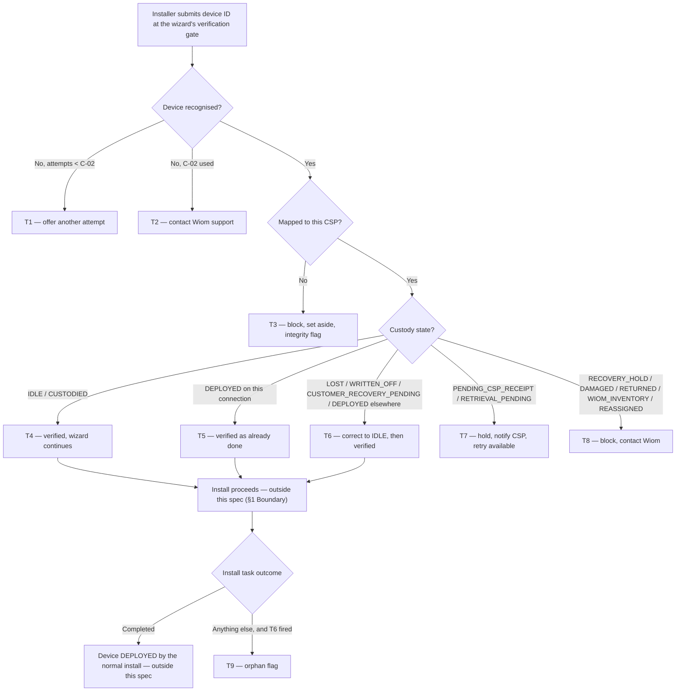

# Install Custody Gate — the device in hand wins

*An install never dies because our records disagree.*

| | | | |
|---|---|---|---|
| **Owner** — Jaivin Prajapati (PM) | **Reviewer** — [Eng lead — TBD] ⚠️ *AI GENERATED — review* | **Status** — Draft | **Sign-off** — Pending |
| **Version** — v0.1 · 2026-07-26 | **Consulted — CSP App** — [name] ⚠️ *AI GENERATED — review* | **Consulted — Device custody (ACS)** — [name] ⚠️ *AI GENERATED — review* | **Consulted — Connection lifecycle** — [name] ⚠️ *AI GENERATED — review* |

> **ID system:** Gn guardrails (§1) · Mn metrics (§1) · Rn rules with lettered obligations (§2) · Tn transitions (§3b, canon) · C-nn config (§5) · MQ-n measurement (§6) · AC-GROUP-n acceptance criteria (§7).
>
> **Reading contract:** §3b is canon — if any statement disagrees with it, §3b wins, except dispatch order, which the §3a chart and its precedence rules own. Every fact has one home; every other mention is an ID reference. Every number outside §5 is a C-id, except concrete example data in §7 and §1 baselines. This document states **what and why** — decomposition, schema, storage, retries and instrumentation belong to the implementer.
>
> **Companion document.** The *Confirm Device Custody* PRD is canon for what a custody correction **does** — the cascade, the penalty reversal, the customer announcement. This spec adds a second way to reach it and never restates it.

---

## 1. Objective & Definition of Success

**Objective.** When the device in the installer's hands is not what Wiom's records say it is, the install carries on anyway — the record is corrected on the spot, and nobody leaves a customer's home to sort out paperwork.

**Boundary.** This spec governs the **device-ID verification gate** at the start of the install wizard's configuration step — what that gate answers for each custody state of a device mapped to the installing CSP, and what the wizard does with the answer.

Every correction lands the device at **IDLE**. The wizard's normal IDLE → DEPLOYED install then completes the job as it does today. This spec never moves a device to DEPLOYED itself.

It **leaves unchanged**:
- The other screens of the install wizard — photos, Aadhaar, payment, router configuration, happy code. Only the verification gate's answer changes (AC-REG-1).
- The IDLE and CUSTODIED happy path. A device already in a good state verifies exactly as it does today (AC-REG-2).
- **What a custody correction does.** Deactivating the old customer's connection, closing the entitlement, cancelling the ISP ticket, closing the complaint, reversing the loss penalty, clearing the write-off record, announcing the recovery — all of it is the *Confirm Device Custody* PRD's, unchanged and uncopied. This spec only adds a second doorway to it (AC-REG-3).
- **Confirming receipt** and **cancelling a return** — the gate points at those existing flows and does not duplicate them (AC-REG-4).

It explicitly **excludes**:
- **Cross-CSP.** A device mapped to another CSP is never corrected here. It is blocked and flagged (G1).
- **Any customer handshake, in V1.** A correction on a device that is with another customer (DEPLOYED, CUSTOMER_RECOVERY_PENDING) proceeds on the installer's action alone. A handshake with the **old** customer is **deferred to V2**, and will mirror whatever the *Confirm Device Custody* PRD adopts for its own V2 — the two paths must not diverge.
- **Reverting a correction.** V1 records an orphaned correction (R9) and stops there — no block, no rollback.

### Guardrails — promises that hold on every path

| ID | Guardrail | One line | Anchors |
|---|---|---|---|
| G1 | **Own devices only** | The gate only ever corrects a device already mapped to the installing CSP; another CSP's device is blocked and flagged, never corrected. | R7a · R7b · AC-BLOCK-1 · AC-GRD-1 · MQ-5 |
| G2 | **Never silent** | Every verification ends in an answer the installer can read and act on — a device is never rejected into silence. | R1c · R1 MUST NOT · AC-GRD-2 · MQ-6 |
| G3 | **One landing state** | Every correction lands at IDLE and hands back to the normal install; this gate never deploys a device itself. | R2a · AC-GRD-3 · MQ-2 |
| G4 | **A correction is never lost** | If a correction is made and the install then does not complete, Wiom is told what was changed and what it cascaded. | R9a · AC-GRD-4 · MQ-4 |
| G5 | **One set of custody rules** | A correction reached from the install gate produces exactly the same effects as the same correction reached from the scanner — never a reduced version. | R3a · AC-GRD-5 · MQ-3 |

### Success metrics

| ID | Metric | Baseline | Target | Source |
|---|---|---|---|---|
| M1 | Install attempts that fail at the device-verification gate because of the device's custody state. | [to be measured from install-failure data before launch] ⚠️ *AI GENERATED — review* | −90% within 2 months ⚠️ *AI GENERATED — review* | MQ-1 |

**Invariant (not a metric):** **G1** devices corrected for a CSP they are not mapped to = **0**, zero tolerance. Monitored via MQ-5.
**Invariant (not a metric):** **G2** verifications ending with no answer shown to the installer = **0**, zero tolerance. Monitored via MQ-6.

---

## 2. User Stories & Rules

| ID | Story | MUST | MUST NOT |
|---|---|---|---|
| R1 | As the installer at a customer's home, I enter the device ID and want to know at once whether I can carry on. | **(a)** Resolve the device against those mapped to my CSP. **(b)** Answer within C-01. **(c)** Give a readable reason on **every** outcome — proceed, corrected, blocked or not found. | End a verification with no answer shown to me (G2). |
| R2 | As the installer, when the record is wrong about a device I am holding, I want it fixed here rather than being sent away. | **(a)** For a device that is LOST, WRITTEN_OFF, CUSTOMER_RECOVERY_PENDING, or DEPLOYED on another connection: correct it to IDLE and let me carry on in the same session. **(b)** Tell me plainly what was corrected. | **(a)** Make me wait for the CSP, Wiom or anyone else to act first. **(b)** Ask the customer, old or new, for anything in V1 — the handshake is V2 (§1 Boundary). |
| R3 | As Wiom, a correction made at install must mean exactly what the same correction means anywhere else. | **(a)** Apply the *Confirm Device Custody* PRD's effects in full for the source state — cascade, penalty reversal and recovery announcement alike. | Apply a reduced or deferred version of those effects because the correction happened mid-install (G5). |
| R4 | As the installer, I do not want to be interviewed about a device while a customer waits. | **(a)** Take the wizard's own record — the session's photos, the task, the customer, the location and my identity — as the evidence for the correction. | Ask me for a separate where-found note or an extra photo for the correction. |
| R5 | As the installer, when only the CSP can unblock the device, I want them told immediately so I can retry on this visit. | **(a)** Hold the gate for a device awaiting receipt (PENDING_CSP_RECEIPT) or awaiting return (RETRIEVAL_PENDING). **(b)** Notify the CSP within C-04 of what is needed. **(c)** Let me retry as soon as they have done it, without restarting the wizard. | Correct either state myself — receipt and return-cancellation are the CSP's existing flows (§1 Boundary). |
| R6 | As Wiom, a device that genuinely must not be installed should not be installable, however inconvenient. | **(a)** Block a device on recovery hold (RECOVERY_HOLD), DAMAGED, RETURNED, parked in Wiom inventory (WIOM_INVENTORY) or being reassigned (REASSIGNED), and tell the installer to contact Wiom. | Offer any correction path for these states. |
| R7 | As Wiom, an installer holding another CSP's device is the signal I most need to see. | **(a)** Block, and tell the installer to set the device aside and contact Wiom. **(b)** Raise an integrity flag and record it. | **(a)** Correct or install it. **(b)** Change anything about the device. |
| R8 | As the installer, if the ID will not resolve, I want a few tries then a way out. | **(a)** Allow C-02 attempts. **(b)** After the last, tell me to contact Wiom support. | Offer more than C-02 attempts. |
| R9 | As Wiom, when a device was corrected for an install that then did not happen, I need to know — the device moved on a justification that evaporated. | **(a)** Where a correction was made at the gate and the install task later ends in anything other than success, raise an orphan flag carrying the device, the CSP, the installer, the state it was corrected from, what that correction cascaded, and how the install ended. **(b)** Review it within C-03. | **(a)** Block the correction, the install or the CSP on account of this flag in V1. **(b)** Reverse the correction automatically — the CSP does hold the device; only the reason for the move is void. |
| R10 | As the installer re-entering a task, I should not be punished for a device that is already mine and already on this connection. | **(a)** Treat a device already DEPLOYED on **this** connection as verified, and carry on. | Treat it as a correction or raise any flag for it. |
| R11 | As Wiom, I want to reconstruct any gate decision afterwards. | **(a)** Record every verification that corrected, blocked or flagged a device, with the installer, the task, the time and the state found. | Require a record for an attempt that resolved no device (R8). |

---

## 3. System Behaviour

### 3a. System flow chart

**Precedence — P1 (ownership first):** the mapped-to-this-CSP check runs before any state check. Another CSP's device is blocked even when its state is one that would otherwise be corrected (T3, AC-RACE-1).

**Precedence — P2 (edit resets):** if the installer changes the device ID after a verification, that verification is void and the gate re-runs from the top for the new ID. A correction already applied to the first device stands and is not undone (T10, AC-RACE-2).

**Precedence — P3 (first task wins):** if the same device is verified against two install tasks, the first correction wins. The second task sees the device as DEPLOYED on another connection and is dispatched accordingly (AC-RACE-3). ⚠️ *AI GENERATED — review*

### 3b. State transition table — canon

Lifecycle of an **install device verification** — created when the installer submits a device ID at the wizard's verification gate, ending when the gate returns its answer. The device's own custody lifecycle is neighbouring: corrections appear here as side-effects and are defined in the *Confirm Device Custody* PRD. The install task's own lifecycle is out of scope; it appears only in T9.

| ID | From | Action / Trigger | Rule / Check | To | Side-effects |
|---|---|---|---|---|---|
| T1 | — | Device ID submitted, not recognised | Attempts used < C-02 | Submitted | Another attempt offered with a readable reason (R1c, R8a). No record written (R11 MUST NOT). |
| T2 | Submitted | Last allowed attempt fails | Attempts used = C-02 | Unresolved | Installer told to contact Wiom support (R8b). No record written. |
| T3 | — | Device mapped to a different CSP | — | Blocked — other CSP | Installer told to set the device aside and contact Wiom (R7a). Integrity flag raised and recorded (R7b, R11a, G1). Device untouched (R7 MUST NOT b). |
| T4 | — | Device is IDLE or CUSTODIED under this CSP | — | Verified | Gate passes within C-01 (R1b). Wizard continues unchanged. No correction, no flag. |
| T5 | — | Device is DEPLOYED on **this** task's connection | — | Verified | Treated as already done (R10a). No correction, no flag (R10 MUST NOT). |
| T6 | — | Device is LOST, WRITTEN_OFF, CUSTOMER_RECOVERY_PENDING, or DEPLOYED on another connection | — | Verified with correction | Device corrected to IDLE (R2a, G3). The full effects for that source state fire per the *Confirm Device Custody* PRD — connection deactivation and cascade, penalty reversal, exposure restoration, recovery announcement (R3a, G5). Installer told what was corrected (R2b). Wizard's own session record stands as the evidence; no note or extra photo requested (R4a, R4 MUST NOT). Correction recorded (R11a). |
| T7 | — | Device is awaiting receipt (PENDING_CSP_RECEIPT) or awaiting return (RETRIEVAL_PENDING) | — | Held for CSP | Gate holds with a readable reason (R1c, R5a). CSP notified within C-04 of the exact action needed (R5b). Installer may retry in the same session once the CSP has acted, without restarting the wizard (R5c). Device untouched. |
| T8 | — | Device is on recovery hold (RECOVERY_HOLD), DAMAGED, RETURNED, WIOM_INVENTORY or REASSIGNED | — | Blocked — not installable | Installer told no install is possible and to contact Wiom (R6a). No correction offered (R6 MUST NOT). Device untouched. Recorded (R11a). |
| T9 | Verified with correction | Install task ends in anything other than success | T6 fired for this task | Orphaned | Orphan flag raised carrying device, CSP, installer, corrected-from state, what the correction cascaded, and how the install ended (R9a, G4). Reviewed within C-03 (R9b). Nothing is blocked and the correction is not reversed (R9 MUST NOT). |
| T10 | Verified / Verified with correction | Installer edits the device ID | — | Submitted | The verification is void and the gate re-runs for the new ID (P2). Any correction already applied to the previous device stands (P2). |
| T11 | Any of the above | The gate cannot reach custody to get an answer | — | Unresolved | The installer is told the check could not be completed and to retry or contact support — never a blank screen or a silent pass (G2). The device is not corrected and the install does not proceed on an unverified device. ⚠️ *AI GENERATED — review* |

---

## 4. Screen Requirements

**Experience intent:** the installer should never feel the system is arguing with them about a device they are holding. Either it just works, or they are told in one line what is wrong and who fixes it.

**Master design file:** *Not yet created.* This spec goes to the design team; designs are added against these blocks. Flow and logic are settled here and are not re-opened at design time. The gate itself is an existing surface — the install wizard's device-ID entry and verification step — and these blocks describe only what changes in its answers.

### Device ID verification gate — [design link pending]

**States:** entry (no ID yet) · checking (verification in flight) · verified (T4, T5) · verified with correction (T6) · held for CSP (T7) · blocked (T3, T8) · not recognised (T1, T2) · unavailable (T11)
**Freshness:** an answer within C-01 of submission

| Element | Source / Routes to | Logic |
|---|---|---|
| Field — device ID | installer input | existing entry; editing after an answer voids it (P2, T10) |
| Action — verify | T1–T8 via §3a | existing gate action |
| Field — attempts remaining | C-02 · computed | shown from the second attempt (R8a) |
| Field — outcome reason | T1–T8, T11 | one readable line on **every** outcome — never blank (R1c, G2) |
| Field — what was corrected | T6 | correction state only: says the device was recovered and is now in the CSP's stock, in plain words (R2b) |
| Field — who must act | T7 | held state only: names the CSP action needed — confirm receipt, or cancel the return (R5a) |
| Action — retry | T7 | held state only; re-runs the gate without restarting the wizard (R5c) |
| Action — contact Wiom | T2, T3, T8 | shown on every terminal block |
| Check — proceed gate | T4, T5, T6 | the wizard advances only from a verified state; nothing downstream renders otherwise |

### CSP app — install blocked notification — [design link pending]

**States:** action needed (T7 raised) · cleared (CSP has acted)
**Freshness:** appears within C-04 of the gate holding

| Element | Source / Routes to | Logic |
|---|---|---|
| Field — device, customer, installer | T7 | always shown |
| Field — action needed | T7 | confirm receipt, or cancel the return — the specific one |
| Action — do it now | existing confirm-receipt / cancel-return flows | opens the existing flow; on success the installer's retry succeeds |
| Field — someone is waiting | T7 | states that an install is held at a customer's home right now |

### Wiom — orphan correction review — [design link pending]

**States:** open · reviewed
**Freshness:** a new flag appears within C-04 of being raised ⚠️ *AI GENERATED — review*

| Element | Source / Routes to | Logic |
|---|---|---|
| Field — device, CSP, installer, task | R9a | always shown |
| Field — corrected from | T6 | the state the device was corrected out of |
| Field — what it cascaded | T6 · Confirm Device Custody PRD | whether a connection was deactivated, a penalty reversed, a pickup closed |
| Field — how the install ended | R9a | the install task's outcome |
| Field — age against C-03 | C-03 | flags past C-03 surface first |

---

## 5. Configurability

| ID | Parameter | Default | Range | Who changes it |
|---|---|---|---|---|
| C-01 | Verification answer shown to the installer after submitting a device ID (R1b, T4) | 5 seconds ⚠️ *AI GENERATED — review* | 3–10 seconds | Engineering |
| C-02 | Verification attempts allowed before the installer is sent to support (T1, T2, R8a) | 3 | Fixed in V1 | Product |
| C-03 | Review window for an orphan correction flag (T9, R9b) | 2 working days ⚠️ *AI GENERATED — review* | 1–5 working days | Ops |
| C-04 | CSP notification latency when an install is held on their action (T7, R5b) | 30 seconds ⚠️ *AI GENERATED — review* | 10–120 seconds | PM + Engineering |

**Interaction note (C-01 × C-04):** these serve two different people. C-01 is what the installer waits for at the gate; C-04 is how fast the CSP learns they are holding up a visit. The installer is never held for C-04 — the held state renders as soon as the gate answers, and the notification races them.

**Interaction note (C-02 × C-04):** an installer who exhausts C-02 attempts is sent to support, not to the CSP. A device that will not resolve is not a CSP-actionable problem, so no notification fires for it.

---

## 6. Measurement

| ID | The system must be able to answer… | Feeds |
|---|---|---|
| MQ-1 | How many install attempts fail at the device-verification gate on custody state, before and after launch — split by the state that caused it. | M1 |
| MQ-2 | How many devices were corrected at the gate, split by source state, and whether any ended anywhere other than IDLE. | G3 |
| MQ-3 | For gate corrections, whether the same cascade, reversal and announcement fired as for the equivalent scanner correction — any difference between the two paths. | G5 |
| MQ-4 | How many corrections were followed by a failed install (orphan flags), how they ended, and how many were reviewed inside C-03. | G4 · R9 |
| MQ-5 | How many cross-CSP install attempts were blocked, for which device and which pair of CSPs. | G1 invariant · R7b |
| MQ-6 | Whether every verification returned an answer to the installer — and how many ended unresolved because custody could not be reached. | G2 invariant · T11 |
| MQ-7 | How often the gate held for a CSP action, how long until the CSP acted, and how often the installer's retry then succeeded on the same visit. | R5 · C-04 |
| MQ-8 | How many verifications ended unresolved after C-02 attempts. | R8 |

---

## 7. Acceptance Criteria

> Device ids, CSP ids, customer names and dates below are illustrative worked-example values, not real cases. ⚠️ *AI GENERATED — review*

### PASS — Device already in a good state (T4, T5)

| AC | Given / When / Then | Verifies | Status |
|---|---|---|---|
| AC-PASS-1 | **Given** device GX90110 is CUSTODIED under CSP a0a0j6 and an install task for customer Sunita R., **When** the installer submits GX90110 at the gate, **Then** it verifies within C-01 (5 s), the wizard continues, and no correction or flag exists. | R1a · R1b · T4 | Settled |
| AC-PASS-2 | **Given** device GX90111 is IDLE under CSP a0a0j6, **When** the installer submits it, **Then** it verifies exactly as it does today — this spec changes nothing on the happy path. | T4 · §1 Boundary | Settled |
| AC-PASS-3 | **Given** device GX90112 is already DEPLOYED on the very connection this install task is for (installer re-entered the task), **When** they submit it, **Then** it verifies as already done, and no correction and no orphan flag are raised. | R10a · R10 MUST NOT · T5 | Settled |

### FIX — Correcting a wrong record (T6)

| AC | Given / When / Then | Verifies | Status |
|---|---|---|---|
| AC-FIX-1 | **Given** device GX90220 is LOST under CSP a0a0j6 with a ₹2,000 loss penalty already recovered, **When** the installer submits it at the gate on 5 Aug 2026, **Then** it is corrected to IDLE, the penalty reversal is logged exactly as the Confirm Device Custody PRD specifies, the installer is told the device was recovered, and the wizard continues in the same session with no wait on the CSP or Wiom. | R2a · R2b · R2 MUST NOT(a) · R3a · T6 · G3 · G5 | Settled |
| AC-FIX-2 | **Given** device GX90221 is WRITTEN_OFF under CSP a0a0j6, **When** the installer submits it, **Then** it is corrected to IDLE, the recorded liability is cleared with no credit raised, and the install continues. | R2a · R3a · T6 · G3 | Settled |
| AC-FIX-3 | **Given** device GX90222 is DEPLOYED with customer Ramesh K. on another connection under the same CSP, **When** the installer submits it for Sunita R.'s install, **Then** it is corrected to IDLE, Ramesh K.'s connection is deactivated with his entitlement, ISP ticket and complaint closed, the customer system is told, and the wizard continues — with no request made of either customer. | R2a · R2 MUST NOT(b) · R3a · T6 · G5 | Settled |
| AC-FIX-4 | **Given** device GX90223 is CUSTOMER_RECOVERY_PENDING under CSP a0a0j6 with an open pickup task, **When** the installer submits it, **Then** it is corrected to IDLE, the pickup closes as completed, and the install continues. | R2a · R3a · T6 | Settled |
| AC-FIX-5 | **Given** any of the four correctable states, **When** the correction happens, **Then** the installer is never asked for a where-found note or an additional photo — the wizard's own session record is the evidence. | R4a · R4 MUST NOT · T6 | Settled |
| AC-FIX-6 | **Given** device GX90220 is corrected at the gate, **When** the correction completes, **Then** the device is IDLE and **not** DEPLOYED — it reaches DEPLOYED only when the wizard's normal install completes. | R2a · T6 · G3 | Settled |

### HOLD — Waiting on the CSP (T7)

| AC | Given / When / Then | Verifies | Status |
|---|---|---|---|
| AC-HOLD-1 | **Given** device GX90330 is awaiting receipt (PENDING_CSP_RECEIPT) under CSP a0a0j6, **When** the installer submits it at 10:00, **Then** the gate holds, names confirming receipt as the action needed, and CSP a0a0j6 is notified within C-04 (30 s) that an install is waiting. | R5a · R5b · T7 · C-04 | Settled |
| AC-HOLD-2 | **Given** that hold, **When** the CSP confirms receipt at 10:04 and the installer retries at 10:05, **Then** the gate passes and the wizard continues from where it was — the installer does not restart the wizard. | R5c · T7 | Settled |
| AC-HOLD-3 | **Given** device GX90331 is awaiting return (RETRIEVAL_PENDING) under CSP a0a0j6, **When** the installer submits it, **Then** the gate holds and points at cancelling the return — the installer is never offered a correction for it. | R5a · R5 MUST NOT · T7 | Settled |

### STOP — Devices that cannot be installed (T3, T8)

| AC | Given / When / Then | Verifies | Status |
|---|---|---|---|
| AC-STOP-1 | **Given** device GX90440 is on recovery hold (RECOVERY_HOLD) under CSP a0a0j6, **When** the installer submits it, **Then** the gate blocks, tells them to contact Wiom, offers no correction, and GX90440 is unchanged. | R6a · R6 MUST NOT · T8 | Settled |
| AC-STOP-2 | **Given** device GX90441 is RETURNED per records but physically in the installer's hands, **When** they submit it, **Then** the gate blocks with a readable reason and the event is recorded. | R6a · R11a · T8 | Settled |
| AC-BLOCK-1 | **Given** device GX90550 is mapped to CSP a0b5s4, **When** an installer for CSP a0a0j6 submits it, **Then** the gate blocks, tells them to set it aside and contact Wiom, an integrity flag records both CSPs and the device, and GX90550's state and mapping are unchanged. | R7a · R7b · R7 MUST NOT(a) · R7 MUST NOT(b) · T3 · G1 | Settled |

### SCAN — Unresolvable IDs (T1, T2)

| AC | Given / When / Then | Verifies | Status |
|---|---|---|---|
| AC-SCAN-1 | **Given** an installer submitting an ID that resolves to nothing, **When** the first attempt fails, **Then** a second is offered with a readable reason and no record is written. | R8a · R11 MUST NOT · T1 | Settled |
| AC-SCAN-2 | **Given** C-02 is 3, **When** the third attempt fails, **Then** no fourth is offered and the installer is told to contact Wiom support. | R8b · R8 MUST NOT · T2 · C-02 | Settled |

### ORPHAN — Correction without a completed install (T9)

| AC | Given / When / Then | Verifies | Status |
|---|---|---|---|
| AC-ORPHAN-1 | **Given** device GX90222 was corrected out of DEPLOYED at the gate on 5 Aug 2026 and Ramesh K.'s connection was deactivated, **When** Sunita R.'s install task is later abandoned, **Then** an orphan flag exists naming GX90222, the CSP, the installer, the corrected-from state, the fact that a connection was deactivated, and the install's outcome. | R9a · T9 · G4 | Settled |
| AC-ORPHAN-2 | **Given** that orphan flag, **When** it is raised, **Then** nothing is blocked — the CSP can keep working, the device stays IDLE, and no reversal is attempted automatically. | R9 MUST NOT(a) · R9 MUST NOT(b) · T9 | Settled |
| AC-ORPHAN-3 | **Given** device GX90110 verified cleanly at the gate with no correction, **When** its install task is later abandoned, **Then** **no** orphan flag is raised — the flag exists only where a correction was made. | T9 · R9a | Settled |
| AC-ORPHAN-4 | **Given** an orphan flag raised on 5 Aug 2026, **When** C-03 (2 working days) passes without review, **Then** it surfaces ahead of newer flags in the review queue. | R9b · C-03 | Settled |

### RACE — Precedence rules

| AC | Given / When / Then | Verifies | Status |
|---|---|---|---|
| AC-RACE-1 | **Given** device GX90550 is LOST — a correctable state — but mapped to CSP a0b5s4, **When** an installer for a0a0j6 submits it, **Then** it is blocked as another CSP's device and never corrected: ownership is checked before state. | P1 · T3 · G1 | Settled |
| AC-RACE-2 | **Given** the installer corrected GX90220 out of LOST and then changes the device ID to GX90221, **When** they submit the new ID, **Then** the gate re-runs fully for GX90221, and GX90220 remains IDLE — the first correction is not undone. | P2 · T10 | Settled |
| AC-RACE-3 | **Given** device GX90222 is corrected and verified against install task A, **When** a second installer submits GX90222 against install task B, **Then** task B sees it as DEPLOYED on another connection and is dispatched through the chart accordingly — the first task's correction stands. | P3 · T5 · T6 | Settled |

### DUP — Repeated triggers

| AC | Given / When / Then | Verifies | Status |
|---|---|---|---|
| AC-DUP-1 | **Given** GX90220 was corrected out of LOST at the gate, **When** the installer submits the same ID again in the same session, **Then** it verifies as IDLE with no second correction and no second penalty reversal. | T4 · T6 · R10 MUST NOT | Settled |
| AC-DUP-2 | **Given** the verify action is submitted twice by a double tap, **When** both arrive, **Then** exactly one correction is applied and one record written. | T6 · R11a | Settled |

### WF — Workflows

| AC | Given / When / Then | Verifies | Status |
|---|---|---|---|
| AC-WF-1 | **Given** CSP a0a0j6's technician arrives at Sunita R.'s home on 5 Aug 2026 holding GX90220, which Wiom's records show as LOST with a ₹2,000 penalty already recovered, **When** they run the wizard end to end, **Then** the gate corrects GX90220 to IDLE and lets them straight through, the penalty reversal is logged, the install completes, GX90220 is DEPLOYED on Sunita's connection, no orphan flag exists, and nobody rescheduled the visit. | T6 · R2a · R3a · G3 · G5 · M1 | Settled |
| AC-WF-2 | **Given** the same technician arrives holding GX90330, which is still awaiting receipt (PENDING_CSP_RECEIPT), **When** the gate holds, the CSP confirms receipt on their phone within C-04 (30 s) and the technician retries, **Then** the wizard resumes at the gate without restarting, the install completes, and no correction or flag was ever raised. | T7 · R5a · R5b · R5c | Settled |
| AC-WF-3 | **Given** GX90222 is corrected out of DEPLOYED for Sunita's install, deactivating Ramesh K.'s connection, **When** the install is then abandoned because the customer is unreachable, **Then** GX90222 stays IDLE with CSP a0a0j6, an orphan flag records the deactivation and the abandonment, and Wiom can see that Ramesh lost service for an install that never happened. | T6 · T9 · R9a · G4 | Settled |

### BV — Boundary values (C-02 attempts)

| AC | Given / When / Then | Verifies | Status |
|---|---|---|---|
| AC-BV-1 | **Given** C-02 is 3, **When** the installer's second attempt fails, **Then** a third is still offered. | C-02 · T1 | Settled |
| AC-BV-2 | **Given** C-02 is 3, **When** the third fails, **Then** no fourth is offered and the support message appears. | C-02 · T2 | Settled |

### CFG — Configurability

| AC | Given / When / Then | Verifies | Status |
|---|---|---|---|
| AC-CFG-1 | **Given** C-02 is changed from 3 to 2, **When** the installer's second attempt fails, **Then** the support message appears immediately and no third attempt is offered. | C-02 · R8a | Settled |

### FAIL — Failure windows (C-01, C-04) and when the check cannot run (T11)

| AC | Given / When / Then | Verifies | Status |
|---|---|---|---|
| AC-FAIL-1 | **Given** custody cannot be reached, **When** the installer submits a device ID, **Then** they are told the check could not be completed and offered a retry — never a blank screen, and never a silent pass into the wizard. | G2 · T11 | Settled |
| AC-FAIL-2 | **Given** that same failure, **When** it happens, **Then** no device is corrected and the install does not proceed on an unverified device. | T11 · G3 | Settled |
| AC-FAIL-3 | **Given** an installer submits a device ID at 10:00:00, **When** C-01 (5 s) passes at 10:00:05 with no answer from custody, **Then** the gate has shown the check-unavailable state with a retry — it does not keep spinning and does not fall through into the wizard. | C-01 · T11 · G2 | Settled |
| AC-FAIL-4 | **Given** the gate holds on GX90330 at 10:00:00 for a CSP action, **When** C-04 (30 s) passes at 10:00:30 without the CSP being reachable, **Then** the installer's screen already shows the held state and the action needed — the installer is never blocked on the notification landing. | C-04 · T7 · §5 interaction note | Settled |

### REG — Regression, the §1 Boundary

| AC | Given / When / Then | Verifies | Status |
|---|---|---|---|
| AC-REG-1 | **Given** a device that verifies cleanly, **When** the installer completes the wizard, **Then** every screen after the gate — photos, Aadhaar, payment, router configuration, happy code — behaves exactly as before this spec. | §1 Boundary | Settled |
| AC-REG-2 | **Given** a CUSTODIED or IDLE device, **When** it is verified, **Then** the gate behaves exactly as it does today, with no new screen or step. | §1 Boundary · T4 | Settled |
| AC-REG-3 | **Given** the same device in the same state, **When** it is corrected once via the scanner and once via the install gate, **Then** both produce identical custody, money and notification outcomes. | §1 Boundary · R3a · G5 · MQ-3 | Settled |
| AC-REG-4 | **Given** a CSP using confirm-receipt or cancel-return directly, **When** they do so, **Then** both flows behave exactly as before — the gate points at them and does not replace them. | §1 Boundary · R5 | Settled |

### GRD — Guardrails across paths

| AC | Given / When / Then | Verifies | Status |
|---|---|---|---|
| AC-GRD-1 | **Given** any device mapped to a CSP other than the installing one, in any state whatsoever, **When** it is submitted at the gate, **Then** it is never corrected and a flag is always raised. | G1 invariant · T3 | Settled |
| AC-GRD-2 | **Given** every outcome the gate can produce — pass, correction, hold, block, not-found, unavailable — **When** each occurs, **Then** the installer sees a readable reason in all six cases, and in none of them is the verification left with no answer on screen. | G2 invariant · R1c · R1 MUST NOT · T1–T8 · T11 | Settled |
| AC-GRD-3 | **Given** corrections from all four correctable states, **When** each completes, **Then** every one lands at IDLE — the gate never produces a DEPLOYED device. | G3 · T6 | Settled |
| AC-GRD-4 | **Given** a correction followed by a failed install, **When** the task ends, **Then** an orphan flag always exists — a correction is never lost silently. | G4 · T9 | Settled |
| AC-GRD-5 | **Given** a LOST device corrected at the install gate, **When** the correction completes, **Then** the penalty reversal, exposure restoration and recovery announcement are identical to the scanner path's — no effect is skipped or deferred because the correction happened mid-install. | G5 · R3a · R3 MUST NOT · MQ-3 | Settled |

---

## 8. Glossary

| Term | Meaning | Owner (domain) |
|---|---|---|
| Installer | **Canonical definition:** whoever runs the install wizard at the customer's home — the CSP themselves or their field technician. One app, one wizard, one set of rights: this spec draws no distinction between them in V1. | CSP App |
| Verification gate | **Canonical definition:** the device-ID entry and verification step in the install wizard, which must return a positive answer before any later screen renders. The single point this spec governs. | CSP App |
| Custody correction | Moving a device to IDLE from a state that does not match physical reality, with all the consequences defined in the *Confirm Device Custody* PRD. Reachable two ways: the CSP's scanner, and this gate. | Device custody |
| Orphan correction | A custody correction made at the gate for an install that then did not complete. The device is genuinely with the CSP, so the state stands — but the reason it moved no longer exists, which is why Wiom is told (R9). | Device custody |
| Idle — `IDLE` | The device is with the CSP and available to give to a customer. Where every correction lands, and what the install wizard then deploys from. | Device custody |
| Custodied — `CUSTODIED` | Received by the CSP but not yet used. Verifies at the gate exactly like IDLE. | Device custody |
| Deployed — `DEPLOYED` | Installed and serving a customer. On *this* task's connection it means the install is already done; on another connection it is a correctable state. | Device custody |
| Awaiting customer recovery — `CUSTOMER_RECOVERY_PENDING` | Wiom has asked for the device back from a customer and is waiting. | Device custody |
| Lost — `LOST` | Written off as unrecoverable, with a loss penalty raised against the CSP. A device turning up at an install is exactly the case this spec exists for. | Device custody |
| Written off — `WRITTEN_OFF` | Closed out after a failed return, carrying a recorded but never-collected liability. | Device custody |
| Awaiting receipt — `PENDING_CSP_RECEIPT` | Dispatched to the CSP, who has not yet confirmed they received it. Physically in hand at an install, so the step was simply skipped — the CSP completes it and the installer retries. | Device custody |
| Awaiting return — `RETRIEVAL_PENDING` | Marked to go back to Wiom. The CSP can cancel their own return; a Wiom-initiated one they cannot. | Device custody |
| Recovery hold — `RECOVERY_HOLD` | Recovered late by a third party; must go back to Wiom before any redeployment. Never installable. | Device custody |
| Integrity flag | Raised when an installer presents a device mapped to a different CSP. Blocks the install and is the signal Wiom most needs about stock moving between CSPs (G1). | Device custody / Ops |

---

## 9. Notes for System Capabilities

What the platform must be able to do for this feature to exist. Whether these are one system or several, and how they interact, is the implementer's design.

| Capability | Needed by |
|---|---|
| Answer, for a device ID and an installing CSP, whether the device may be installed — resolving against **every** custody state including lost and written-off devices, which today's device lookups exclude. | R1a · T1–T8 · G1 |
| Return a distinct, readable reason for every outcome of that check, including the case where the check itself cannot run. | R1c · G2 · T11 |
| Apply a custody correction to IDLE from the install path, invoking the same effects as the scanner path rather than a copy of them. | R2a · R3a · T6 · G3 · G5 |
| Let a held install be retried in the same session once the CSP has acted, without losing wizard progress. | R5c · T7 |
| Notify a CSP within C-04 that an install is held on a specific action of theirs. | R5b · T7 · C-04 |
| Correlate a gate correction with the eventual outcome of the install task that caused it, and raise a flag when the two do not match. | R9a · T9 · G4 |
| Raise, hold and surface integrity flags and orphan flags for review within C-03. | R7b · R9b · T3 · T9 · C-03 |
| Answer the measurement questions across gate outcomes, corrections, orphan flags and cross-path equivalence. | MQ-1 – MQ-8 |

---

## AI-generated content for review

*Not sign-off-ready until every row is confirmed or corrected.*

| Location | What was generated | Basis |
|---|---|---|
| Header — Reviewer, Consulted (×3) | Placeholders | Need the eng lead and consulted owners for CSP App, Device custody (ACS) and Connection lifecycle. |
| §1 M1 — baseline | "To be measured before launch" | You named the metric but not its current value. Install-failure data should give it. |
| §1 M1 — target (−90% in 2 months) | Target figure | Inferred. Near-total elimination is the intent of the feature; confirm the number you would call success. |
| §5 C-01 — 5 seconds, 3–10 s | Gate answer latency | Matches the confirm-custody spec's scan latency for consistency. Engineering should confirm it is achievable against a custody lookup. |
| §5 C-03 — 2 working days, 1–5 | Orphan flag review window | Inferred, mirroring the confirm-custody spec's flag review window. Ops should own and confirm. |
| §5 C-04 — 30 seconds, 10–120 s | CSP notification latency | Inferred. Someone is standing in a customer's home, so it needs to be fast; confirm what is realistic. |
| §3b T11 | The check-unavailable envelope | You did not specify what happens if the custody lookup itself fails. Proposed: tell the installer, never pass silently, never correct. Confirm. |
| §3a P3 / AC-RACE-3 | Same device on two install tasks | You did not specify this race. Proposed: first correction wins, second task re-dispatches. Confirm. |
| §4 — orphan queue freshness (C-04) | Reused C-04 for the internal queue | Inferred; an internal review queue may tolerate a slower refresh than an installer-facing gate. |
| §7 — all concrete data (device ids GX90110–GX90550; CSPs a0a0j6, a0b5s4; customer names; ₹2,000 penalty; Aug 2026 dates) | Worked-example values | Illustrative only. Swap for real cases if you want these ACs runnable against production data as-is. |
