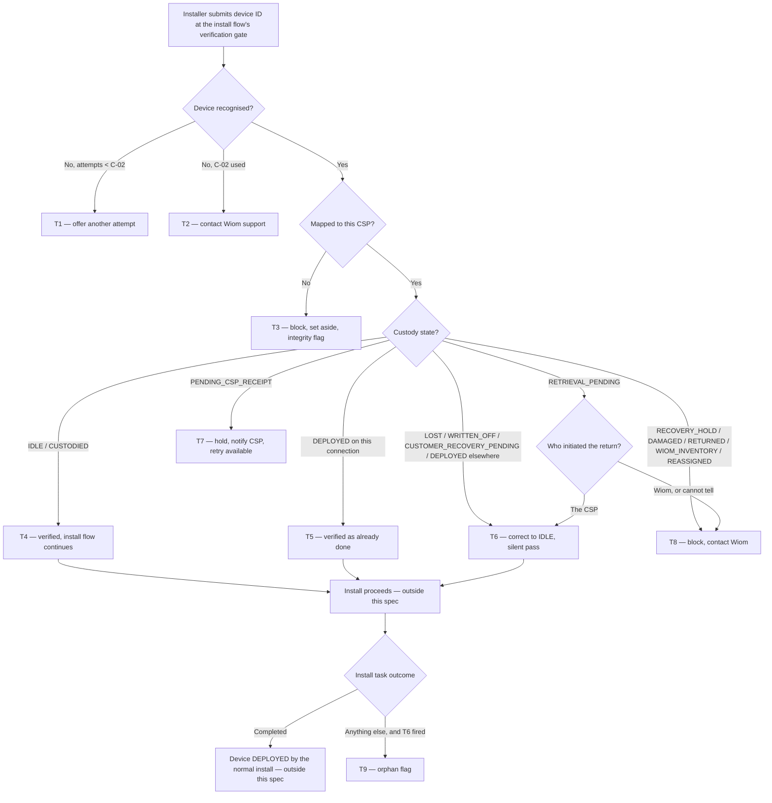

# Install Custody Gate (v0.2) — the device in hand wins

*An install never dies because our records disagree.*

> **Relationship to v0.1.** `Install_Custody_Gate_PRD.md` (v0.1 · 2026-07-26) is **retained unchanged** as the original submission behind [csp-os-yaml#1253](https://github.com/wiom-tech/csp-os-yaml/issues/1253). This document is a **separate, parallel version** — same feature, resequenced so that build can begin without waiting on design files. Where the two disagree, **v0.2 governs the build**; v0.1 remains the record of what was originally scoped and sent to design.
>
> **What v0.2 changes, in full:** (1) a two-tranche delivery split by design dependency (§1), leaving `PENDING_CSP_RECEIPT` as the only design-gated state; (2) **new G6** — corrections are invisible to the installer, replacing v0.1's R2b "tell me plainly what was corrected"; (3) **G2 relaxed** — Tranche 1 may use the gate's existing generic failure copy, the invariant being that an answer always appears; (4) **`RETRIEVAL_PENDING` split by who initiated the return** (new R12, new precedence P4) — CSP-initiated corrects, Wiom-initiated blocks, replacing v0.1's blanket hold; (5) **`PENDING_CSP_RECEIPT`'s hold re-grounded as a legal requirement** — delivery confirmation is the account owner's attributable act, so neither a technician nor the install flow may discharge it; (6) the orphan flag is a record in Tranche 1, with its review surface in Tranche 2; (7) the **V2 customer handshake is scoped to DEPLOYED only** — CRP is excluded permanently, since Wiom has already asked that customer for the device back; (8) terminology — the sequence of install screens is called the **install flow** throughout, and the person running it is the **technician**, or the **CSP** where the distinction is legally material (R5d).

| | | | |
|---|---|---|---|
| **Owner** — Jaivin Prajapati (PM) | **Reviewer** — [Eng lead — TBD] ⚠️ *AI GENERATED — review* | **Status** — Draft | **Sign-off** — Pending |
| **Version** — v0.2 · 2026-07-28 | **Consulted — CSP App** — [name] ⚠️ *AI GENERATED — review* | **Consulted — Device custody (ACS)** — [name] ⚠️ *AI GENERATED — review* | **Consulted — Connection lifecycle** — [name] ⚠️ *AI GENERATED — review* |

> **ID system:** Gn guardrails (§1) · Mn metrics (§1) · Rn rules with lettered obligations (§2) · Tn transitions (§3b, canon) · C-nn config (§5) · MQ-n measurement (§6) · AC-GROUP-n acceptance criteria (§7).
>
> **Reading contract:** §3b is canon — if any statement disagrees with it, §3b wins, except dispatch order, which the §3a chart and its precedence rules own. Every fact has one home; every other mention is an ID reference. Every number outside §5 is a C-id, except concrete example data in §7 and §1 baselines. This document states **what and why** — decomposition, schema, storage, retries and instrumentation belong to the implementer.
>
> **Companion document.** The *Confirm Device Custody* PRD is canon for what a custody correction **does** — the cascade, the penalty reversal, the customer announcement. This spec adds a second way to reach it and never restates it. **One exception**, called out where it arises: `RETRIEVAL_PENDING` is out of scope in the companion, so this spec owns that source state's effect outright (R12).
>
> **Delivery contract (v0.2).** This spec ships in two tranches, split strictly by whether design is required (§1 *Delivery tranches*). Tranche 1 is buildable now against existing screens. Tranche 2 is the design-gated remainder. No behaviour in Tranche 1 waits on a design file.

---

## 1. Objective & Definition of Success

**Objective.** When the device in the installer's hands is not what Wiom's records say it is, the install carries on anyway — the record is corrected on the spot, and nobody leaves a customer's home to sort out paperwork.

**Boundary.** This spec governs the **device-ID verification gate** at the start of the install flow's configuration step — what that gate answers for each custody state of a device mapped to the installing CSP, and what the install flow does with the answer.

Every correction lands the device at **IDLE**. The install flow's normal IDLE → DEPLOYED install then completes the job as it does today. This spec never moves a device to DEPLOYED itself.

It **leaves unchanged**:
- The other screens of the install flow — photos, Aadhaar, payment, router configuration, happy code. Only the verification gate's answer changes (AC-REG-1).
- The IDLE and CUSTODIED happy path. A device already in a good state verifies exactly as it does today (AC-REG-2).
- **What a custody correction does.** Deactivating the old customer's connection, closing the entitlement, cancelling the ISP ticket, closing the complaint, reversing the loss penalty, clearing the write-off record, announcing the recovery — all of it is the *Confirm Device Custody* PRD's, unchanged and uncopied. This spec only adds a second doorway to it (AC-REG-3).
- **Confirming receipt** and **cancelling a return** — the gate never performs either as a CSP would. It holds for the first (R5) and invokes the existing return-cancellation as a system effect for the second (R12); neither existing CSP flow changes (AC-REG-4).

It explicitly **excludes**:
- **Cross-CSP.** A device mapped to another CSP is never corrected here. It is blocked and flagged (G1).
- **Confirming delivery on the CSP's behalf.** The gate never confirms receipt of a dispatched device, however plainly the device is in the installer's hands. Confirming delivery is a **legal obligation of the account owner** — the CSP — and must remain an act that CSP personally performs and is attributable to them. A field technician cannot discharge it, and it cannot be discharged from inside an install at all — not even when the technician running that install *is* the CSP: the confirmation must be the owner's own action in the owner's own flow, not a side-effect of an install step. This is the reason `PENDING_CSP_RECEIPT` holds rather than self-heals (R5, T7).
- **Any customer handshake, in V1.** A correction on a device that is still with another customer proceeds on the technician's action alone. A handshake with the **old** customer is **deferred to V2 and scoped to DEPLOYED only**, mirroring whatever the *Confirm Device Custody* PRD adopts for its own V2 — the two paths must not diverge.
- **A handshake for CUSTOMER_RECOVERY_PENDING, ever.** CRP means Wiom has **already** asked that customer to give the device back — the request has been made and the customer is on notice. There is no consent left to obtain, so no handshake is required in V1 or V2, and none should be added later by analogy with DEPLOYED. DEPLOYED is different in kind: that customer is being served right now and has been told nothing (R2 MUST NOT(b)).
- **Reverting a correction.** V1 records an orphaned correction (R9) and stops there — no block, no rollback.

### Delivery tranches

The split is by **design dependency only** — not by effort, and not by risk. Every custody state except one lands in Tranche 1.

| | Tranche 1 — no design dependency | Tranche 2 — design-gated |
|---|---|---|
| **Ships against** | The gate's existing screen states: its normal *verified → continue*, and its existing generic verification-failure state | New screen states and a new CSP-app surface |
| **Custody states covered** | IDLE, CUSTODIED, DEPLOYED (this connection **and** elsewhere), LOST, WRITTEN_OFF, CUSTOMER_RECOVERY_PENDING, RETRIEVAL_PENDING (both branches), RECOVERY_HOLD, DAMAGED, RETURNED, WIOM_INVENTORY, REASSIGNED, plus cross-CSP and unrecognised IDs | **PENDING_CSP_RECEIPT only** |
| **Transitions** | T1, T2, T3, T4, T5, T6, T8, T9, T10, T11 | T7 |
| **What makes it design-free** | Corrections are **silent** — the gate answers exactly as it does for a device already in stock (G6). Every block and failure renders through the **existing** generic failure state with generic copy (G2). The orphan flag is a record, surfaced through Wiom's existing reporting — not a designed queue (R9b). | A hold is a state the gate does not have today, and it needs an in-session retry plus a new CSP-app *install blocked* notification with someone-is-waiting urgency (§4) |
| **Also in scope** | Building the gate's backing verification contract, which does not exist today (§9) | Specific outcome copy replacing Tranche 1's generic reasons; the attempts-remaining indicator; the Wiom orphan-correction review surface |
| **Not in either** | — | V2: the old-customer handshake, **DEPLOYED only** (§1 Boundary) |

**Consequence to accept knowingly:** in Tranche 1 an installer who is blocked learns *that* they are blocked and to contact Wiom, but not always *why* in specific words. That is a deliberate trade to avoid gating twelve states on one design file — G2's invariant (never *no* answer) still holds absolutely.

### Guardrails — promises that hold on every path

| ID | Guardrail | One line | Anchors |
|---|---|---|---|
| G1 | **Own devices only** | The gate only ever corrects a device already mapped to the installing CSP; another CSP's device is blocked and flagged, never corrected. | R7a · R7b · AC-BLOCK-1 · AC-GRD-1 · MQ-5 |
| G2 | **Never silent** | Every verification ends in an answer the installer can read and act on — a device is never rejected into silence. In Tranche 1 that answer may be the gate's existing generic reason; the invariant is that an answer always appears, not that its wording is bespoke. | R1c · R1 MUST NOT · AC-GRD-2 · MQ-6 |
| G3 | **One landing state** | Every correction lands at IDLE and hands back to the normal install; this gate never deploys a device itself. | R2a · R12b · AC-GRD-3 · MQ-2 |
| G4 | **A correction is never lost** | If a correction is made and the install then does not complete, Wiom is told what was changed and what it cascaded. | R9a · AC-GRD-4 · MQ-4 |
| G5 | **One set of custody rules** | A correction reached from the install gate produces exactly the same effects as the same correction reached from the scanner — never a reduced version. Equivalence is **per source state**: where the scanner does not handle a state at all (RETRIEVAL_PENDING), there is nothing to match and R12 governs. | R3a · R3b · AC-GRD-5 · AC-REG-3 · MQ-3 |
| G6 | **A correction is invisible to the installer** | A corrected device verifies exactly as a device already in stock does — no notice, no banner, no acknowledgement, no extra tap. The installer's experience of a correction is that nothing went wrong. | R2b · R2 MUST NOT(c) · T6 · AC-GRD-6 · MQ-10 |

### Success metrics

| ID | Metric | Baseline | Target | Source |
|---|---|---|---|---|
| M1 | Install attempts that fail at the device-verification gate because of the device's custody state. | [to be measured from install-failure data before launch] ⚠️ *AI GENERATED — review* | −90% within 2 months ⚠️ *AI GENERATED — review* | MQ-1 |

**Invariant (not a metric):** **G1** devices corrected for a CSP they are not mapped to = **0**, zero tolerance. Monitored via MQ-5.
**Invariant (not a metric):** **G2** verifications ending with no answer shown to the installer = **0**, zero tolerance. Monitored via MQ-6.
**Invariant (not a metric):** **G6** corrections that presented the installer with an extra screen, notice or tap = **0** in V1. Monitored via MQ-10.

---

## 2. User Stories & Rules

| ID | Story | MUST | MUST NOT |
|---|---|---|---|
| R1 | As the installer at a customer's home, I enter the device ID and want to know at once whether I can carry on. | **(a)** Resolve the device against those mapped to my CSP. **(b)** Answer within C-01. **(c)** Give a readable reason on **every** outcome — proceed, blocked, held or not found — generic wording being acceptable in Tranche 1 (G2). | End a verification with no answer shown to me (G2). |
| R2 | As the installer, when the record is wrong about a device I am holding, I want it fixed here rather than being sent away. | **(a)** For a device that is LOST, WRITTEN_OFF, CUSTOMER_RECOVERY_PENDING, or DEPLOYED on another connection: correct it to IDLE and let me carry on in the same session. RETRIEVAL_PENDING is governed by R12. **(b)** Answer exactly as you would for a device already in my stock — the correction is not something I am told about, shown, or asked to confirm (G6). | **(a)** Make me wait for the CSP, Wiom or anyone else to act first. **(b)** Ask the customer, old or new, for anything in V1 — the handshake is V2 and applies to DEPLOYED only, never to CRP (§1 Boundary). **(c)** Show me a correction notice or require me to acknowledge one in V1 (G6). |
| R3 | As Wiom, a correction made at install must mean exactly what the same correction means anywhere else. | **(a)** Apply the *Confirm Device Custody* PRD's effects in full for the source state — cascade, penalty reversal and recovery announcement alike. **(b)** Where that PRD does not govern the source state, apply this spec's own effect and say so (R12). | Apply a reduced or deferred version of those effects because the correction happened mid-install (G5). |
| R4 | As the installer, I do not want to be interviewed about a device while a customer waits. | **(a)** Take the install flow's own record — the session's photos, the task, the customer, the location and my identity — as the evidence for the correction. | Ask me for a separate where-found note or an extra photo for the correction. |
| R5 | As Wiom, delivery of a device must be confirmed by the CSP who owns the account, because that confirmation is a legal record — so an install must never stand in for it. | **(a)** Hold the gate for a device awaiting receipt (PENDING_CSP_RECEIPT). **(b)** Notify the CSP within C-04 of what is needed. **(c)** Let the installer retry as soon as the CSP has confirmed, without restarting the install flow. **(d)** Require the confirmation to be the CSP's own act in the existing confirm-receipt flow, attributable to them, even when the CSP is the technician running the install. | **(a)** Confirm receipt from the gate, infer it from physical possession, or accept a technician's confirmation in place of the owner's (§1 Boundary). **(b)** Treat the install flow's evidence as proof of delivery. |
| R6 | As Wiom, a device that genuinely must not be installed should not be installable, however inconvenient. | **(a)** Block a device on recovery hold (RECOVERY_HOLD), DAMAGED, RETURNED, parked in Wiom inventory (WIOM_INVENTORY) or being reassigned (REASSIGNED), and tell the installer to contact Wiom. **(b)** Treat a Wiom-initiated return identically, per R12c. | Offer any correction path for these states. |
| R7 | As Wiom, an installer holding another CSP's device is the signal I most need to see. | **(a)** Block, and tell the installer to set the device aside and contact Wiom. **(b)** Raise an integrity flag and record it. | **(a)** Correct or install it. **(b)** Change anything about the device. |
| R8 | As the installer, if the ID will not resolve, I want a few tries then a way out. | **(a)** Allow C-02 attempts, through the gate's existing retry. **(b)** After the last, tell me to contact Wiom support. | **(a)** Offer more than C-02 attempts. **(b)** Require a new on-screen attempts indicator to ship V1 — that is Tranche 2. |
| R9 | As Wiom, when a device was corrected for an install that then did not happen, I need to know — the device moved on a justification that evaporated. | **(a)** Where a correction was made at the gate and the install task later ends in anything other than success, raise an orphan flag carrying the device, the CSP, the installer, the state it was corrected from, what that correction cascaded, and how the install ended. **(b)** Make it reviewable within C-03 — in Tranche 1 through Wiom's existing reporting, with a designed review surface in Tranche 2. | **(a)** Block the correction, the install or the CSP on account of this flag in V1. **(b)** Reverse the correction automatically — the CSP does hold the device; only the reason for the move is void. **(c)** Hold Tranche 1 for the review surface. |
| R10 | As the installer re-entering a task, I should not be punished for a device that is already mine and already on this connection. | **(a)** Treat a device already DEPLOYED on **this** connection as verified, and carry on. | Treat it as a correction or raise any flag for it. |
| R11 | As Wiom, I want to reconstruct any gate decision afterwards. | **(a)** Record every verification that corrected, blocked or flagged a device, with the installer, the task, the time and the state found. | Require a record for an attempt that resolved no device (R8). |
| R12 | As the installer holding a device the CSP had decided to send back, I should be able to use it — but a device **Wiom** has called back is not mine to keep. | **(a)** Establish who initiated the outstanding return before deciding. **(b)** **CSP-initiated:** cancel the return and correct the device to IDLE, silently, and let me carry on (G3, G6) — the CSP may already cancel their own return, so the gate exercises a right they hold, on the strength of them putting the device into an install. **(c)** **Wiom-initiated:** block and tell me to contact Wiom (R6a) — the CSP cannot cancel a Wiom-initiated return, and the gate must not do for them what they may not do themselves. **(d)** Where the initiator cannot be determined, block. | **(a)** Correct a Wiom-initiated return, or ask the installer which kind it is. **(b)** Default to correcting when the initiator is unknown. |

---

## 3. System Behaviour

### 3a. System flow chart

**Precedence — P1 (ownership first):** the mapped-to-this-CSP check runs before any state check. Another CSP's device is blocked even when its state is one that would otherwise be corrected (T3, AC-RACE-1).

**Precedence — P2 (edit resets):** if the installer changes the device ID after a verification, that verification is void and the gate re-runs from the top for the new ID. A correction already applied to the first device stands and is not undone (T10, AC-RACE-2).

**Precedence — P3 (first task wins):** if the same device is verified against two install tasks, the first correction wins. The second task sees the device as DEPLOYED on another connection and is dispatched accordingly (AC-RACE-3). ⚠️ *AI GENERATED — review*

**Precedence — P4 (initiator decides a return):** RETRIEVAL_PENDING has no single answer. The initiator of the outstanding return decides between correction and block, and an undeterminable initiator resolves to block, never to correction (R12, T6, T8, AC-RACE-4).

### 3b. State transition table — canon

Lifecycle of an **install device verification** — created when the installer submits a device ID at the install flow's verification gate, ending when the gate returns its answer. The device's own custody lifecycle is neighbouring: corrections appear here as side-effects and are defined in the *Confirm Device Custody* PRD, except the RETRIEVAL_PENDING effect, which is defined in R12. The install task's own lifecycle is out of scope; it appears only in T9.

| ID | From | Action / Trigger | Rule / Check | To | Side-effects | Tranche |
|---|---|---|---|---|---|---|
| T1 | — | Device ID submitted, not recognised | Attempts used < C-02 | Submitted | Another attempt offered with a readable reason (R1c, R8a), through the gate's existing retry. No record written (R11 MUST NOT). | 1 |
| T2 | Submitted | Last allowed attempt fails | Attempts used = C-02 | Unresolved | Installer told to contact Wiom support (R8b). No record written. | 1 |
| T3 | — | Device mapped to a different CSP | — | Blocked — other CSP | Installer told to set the device aside and contact Wiom (R7a), through the existing failure state. Integrity flag raised and recorded (R7b, R11a, G1). Device untouched (R7 MUST NOT b). | 1 |
| T4 | — | Device is IDLE or CUSTODIED under this CSP | — | Verified | Gate passes within C-01 (R1b). Install flow continues unchanged. No correction, no flag. | 1 |
| T5 | — | Device is DEPLOYED on **this** task's connection | — | Verified | Treated as already done (R10a). No correction, no flag (R10 MUST NOT). | 1 |
| T6 | — | Device is LOST, WRITTEN_OFF, CUSTOMER_RECOVERY_PENDING, DEPLOYED on another connection, or RETRIEVAL_PENDING on a **CSP-initiated** return (P4) | R12b for the retrieval case | Verified with correction | Device corrected to IDLE (R2a, R12b, G3). **For the four companion-governed states:** the full effects for that source state fire per the *Confirm Device Custody* PRD — connection deactivation and cascade, penalty reversal, exposure restoration, recovery announcement (R3a, G5). **For a CSP-initiated return:** the outstanding return is cancelled through the existing return-cancellation behaviour and the device becomes available; no connection, penalty or announcement is involved (R3b, R12b). **In every case** the gate answers exactly as it would for a device already in stock — no notice, no acknowledgement (R2b, G6). Install flow's own session record stands as the evidence; no note or extra photo requested (R4a, R4 MUST NOT). Correction recorded (R11a). | 1 |
| T7 | — | Device is awaiting receipt (PENDING_CSP_RECEIPT) | — | Held for CSP | Gate holds with a readable reason (R1c, R5a). CSP notified within C-04 of the exact action needed (R5b). Installer may retry in the same session once the CSP has confirmed receipt in their own flow, without restarting the install flow (R5c). Receipt is never confirmed here, inferred from possession, or taken from a technician (R5d, R5 MUST NOT). Device untouched. | **2** |
| T8 | — | Device is on recovery hold (RECOVERY_HOLD), DAMAGED, RETURNED, WIOM_INVENTORY, REASSIGNED, or RETRIEVAL_PENDING on a **Wiom-initiated or undeterminable** return (P4) | R12c, R12d for the retrieval case | Blocked — not installable | Installer told no install is possible and to contact Wiom (R6a, R6b), through the existing failure state. No correction offered (R6 MUST NOT, R12 MUST NOT). Device untouched. Recorded (R11a). | 1 |
| T9 | Verified with correction | Install task ends in anything other than success | T6 fired for this task | Orphaned | Orphan flag raised carrying device, CSP, installer, corrected-from state, what the correction cascaded, and how the install ended (R9a, G4). Reviewable within C-03 (R9b). Nothing is blocked and the correction is not reversed (R9 MUST NOT). | 1 (record) · 2 (review surface) |
| T10 | Verified / Verified with correction | Installer edits the device ID | — | Submitted | The verification is void and the gate re-runs for the new ID (P2). Any correction already applied to the previous device stands (P2). | 1 |
| T11 | Any of the above | The gate cannot reach custody to get an answer | — | Unresolved | The installer is told the check could not be completed and to retry or contact support — never a blank screen or a silent pass (G2). The device is not corrected and the install does not proceed on an unverified device. ⚠️ *AI GENERATED — review* | 1 |

---

## 4. Screen Requirements

**Experience intent:** the installer should never feel the system is arguing with them about a device they are holding. Either it just works — and a correction is a case of it just working — or they are told in one line what is wrong and who fixes it.

**Master design file:** *Not yet created, and Tranche 1 does not wait for one.* Tranche 1 reuses the gate's existing screen states and adds no new element. Tranche 2 below is what goes to the design team; flow and logic are settled here and are not re-opened at design time.

### Tranche 1 — no new design

The gate is an existing surface: the install flow's device-ID entry and verification step. Tranche 1 changes **which answer it gives**, not what it looks like. Every outcome maps onto a state the screen already has.

| Outcome | Existing state it renders as | Logic |
|---|---|---|
| Verified (T4, T5) | Normal verified → install flow advances | Unchanged from today (AC-REG-2) |
| Verified with correction (T6) | **The same normal verified state** | Indistinguishable from T4 to the installer — no banner, no notice, no extra tap (G6, R2b) |
| Blocked (T3, T8) | Existing verification-failure state, generic reason + contact Wiom | No correction offered; specific per-state copy is Tranche 2 (G2) |
| Not recognised (T1, T2) | Existing retry, then existing failure state | C-02 attempts, no on-screen counter (R8b) |
| Unavailable (T11) | Existing verification-failure state, retry offered | Never a blank screen, never a silent pass (G2) |
| Field — device ID | Existing entry | Editing after an answer voids it (P2, T10) |
| Check — proceed gate | Existing | The install flow advances only from a verified state; nothing downstream renders otherwise |

### Tranche 2 — design required

#### Device ID verification gate — held state — [design link pending]

**States:** held for CSP (T7) · cleared (CSP has confirmed, retry available)
**Freshness:** an answer within C-01 of submission

| Element | Source / Routes to | Logic |
|---|---|---|
| Field — outcome reason, specific | T1–T8, T11 | replaces Tranche 1's generic reason with per-state wording on every outcome (R1c, G2) |
| Field — who must act | T7 | names the CSP action needed: confirm receipt of this device |
| Field — why the installer cannot do it | T7 · §1 Boundary | states, in plain words, that confirming delivery is the CSP's own legal confirmation and cannot be done from here (R5d) |
| Action — retry | T7 | re-runs the gate without restarting the install flow (R5c) |
| Field — attempts remaining | C-02 · computed | shown from the second attempt (R8a) |

#### CSP app — install blocked notification — [design link pending]

**States:** action needed (T7 raised) · cleared (CSP has confirmed receipt)
**Freshness:** appears within C-04 of the gate holding

| Element | Source / Routes to | Logic |
|---|---|---|
| Field — device, customer, installer | T7 | always shown |
| Field — action needed | T7 | confirm receipt of this device |
| Action — do it now | existing confirm-receipt flow | opens the existing flow, performed by the CSP as the owner (R5d); on success the installer's retry succeeds |
| Field — someone is waiting | T7 | states that an install is held at a customer's home right now |

#### Wiom — orphan correction review — [design link pending]

**States:** open · reviewed
**Freshness:** a new flag appears within C-04 of being raised ⚠️ *AI GENERATED — review*

| Element | Source / Routes to | Logic |
|---|---|---|
| Field — device, CSP, installer, task | R9a | always shown |
| Field — corrected from | T6 | the state the device was corrected out of |
| Field — what it cascaded | T6 · Confirm Device Custody PRD · R12b | whether a connection was deactivated, a penalty reversed, a pickup closed, a return cancelled |
| Field — how the install ended | R9a | the install task's outcome |
| Field — age against C-03 | C-03 | flags past C-03 surface first |

---

## 5. Configurability

| ID | Parameter | Default | Range | Who changes it |
|---|---|---|---|---|
| C-01 | Verification answer shown to the installer after submitting a device ID (R1b, T4) | 5 seconds ⚠️ *AI GENERATED — review* | 3–10 seconds | Engineering |
| C-02 | Verification attempts allowed before the installer is sent to support (T1, T2, R8a) | 3 | Fixed in V1 | Product |
| C-03 | Review window for an orphan correction flag (T9, R9b) | 2 working days ⚠️ *AI GENERATED — review* | 1–5 working days | Ops |
| C-04 | CSP notification latency when an install is held on their action (T7, R5b) — **Tranche 2** | 30 seconds ⚠️ *AI GENERATED — review* | 10–120 seconds | PM + Engineering |

**Interaction note (C-01 × C-04):** these serve two different people. C-01 is what the installer waits for at the gate; C-04 is how fast the CSP learns they are holding up a visit. The installer is never held for C-04 — the held state renders as soon as the gate answers, and the notification races them.

**Interaction note (C-02 × C-04):** an installer who exhausts C-02 attempts is sent to support, not to the CSP. A device that will not resolve is not a CSP-actionable problem, so no notification fires for it.

**Tranche note:** C-01, C-02 and C-03 all bind in Tranche 1. C-04 has no effect until T7 ships, since it is the only path that notifies a CSP.

---

## 6. Measurement

| ID | The system must be able to answer… | Feeds |
|---|---|---|
| MQ-1 | How many install attempts fail at the device-verification gate on custody state, before and after launch — split by the state that caused it. | M1 |
| MQ-2 | How many devices were corrected at the gate, split by source state, and whether any ended anywhere other than IDLE. | G3 |
| MQ-3 | For gate corrections, whether the same cascade, reversal and announcement fired as for the equivalent scanner correction — any difference between the two paths, excluding source states the scanner does not handle. | G5 |
| MQ-4 | How many corrections were followed by a failed install (orphan flags), how they ended, and how many were reviewed inside C-03. | G4 · R9 |
| MQ-5 | How many cross-CSP install attempts were blocked, for which device and which pair of CSPs. | G1 invariant · R7b |
| MQ-6 | Whether every verification returned an answer to the installer — and how many ended unresolved because custody could not be reached. | G2 invariant · T11 |
| MQ-7 | How often the gate held for a CSP action, how long until the CSP confirmed receipt, and how often the installer's retry then succeeded on the same visit. | R5 · C-04 |
| MQ-8 | How many verifications ended unresolved after C-02 attempts. | R8 |
| MQ-9 | How many gate hits landed on RETRIEVAL_PENDING, split by initiator — CSP-initiated corrected, Wiom-initiated blocked, initiator undeterminable — and how many returns were cancelled this way. | R12 · P4 |
| MQ-10 | Whether any correction presented the installer with a screen, notice or tap that a device already in stock would not have produced. | G6 invariant |

---

## 7. Acceptance Criteria

> Device ids, CSP ids, customer names and dates below are illustrative worked-example values, not real cases. ⚠️ *AI GENERATED — review*

### PASS — Device already in a good state (T4, T5)

| AC | Given / When / Then | Verifies | Status |
|---|---|---|---|
| AC-PASS-1 | **Given** device GX90110 is CUSTODIED under CSP a0a0j6 and an install task for customer Sunita R., **When** the installer submits GX90110 at the gate, **Then** it verifies within C-01 (5 s), the install flow continues, and no correction or flag exists. | R1a · R1b · T4 | Settled |
| AC-PASS-2 | **Given** device GX90111 is IDLE under CSP a0a0j6, **When** the installer submits it, **Then** it verifies exactly as it does today — this spec changes nothing on the happy path. | T4 · §1 Boundary | Settled |
| AC-PASS-3 | **Given** device GX90112 is already DEPLOYED on the very connection this install task is for (installer re-entered the task), **When** they submit it, **Then** it verifies as already done, and no correction and no orphan flag are raised. | R10a · R10 MUST NOT · T5 | Settled |

### FIX — Correcting a wrong record (T6)

| AC | Given / When / Then | Verifies | Status |
|---|---|---|---|
| AC-FIX-1 | **Given** device GX90220 is LOST under CSP a0a0j6 with a ₹2,000 loss penalty already recovered, **When** the installer submits it at the gate on 5 Aug 2026, **Then** it is corrected to IDLE, the penalty reversal is logged exactly as the Confirm Device Custody PRD specifies, and the install flow continues in the same session with no wait on the CSP or Wiom. | R2a · R2 MUST NOT(a) · R3a · T6 · G3 · G5 | Settled |
| AC-FIX-2 | **Given** device GX90221 is WRITTEN_OFF under CSP a0a0j6, **When** the installer submits it, **Then** it is corrected to IDLE, the recorded liability is cleared with no credit raised, and the install continues. | R2a · R3a · T6 · G3 | Settled |
| AC-FIX-3 | **Given** device GX90222 is DEPLOYED with customer Ramesh K. on another connection under the same CSP, **When** the installer submits it for Sunita R.'s install, **Then** it is corrected to IDLE, Ramesh K.'s connection is deactivated with his entitlement, ISP ticket and complaint closed, the customer system is told, and the install flow continues — with no request made of either customer. | R2a · R2 MUST NOT(b) · R3a · T6 · G5 | Settled |
| AC-FIX-4 | **Given** device GX90223 is CUSTOMER_RECOVERY_PENDING under CSP a0a0j6 with an open pickup task, **When** the installer submits it, **Then** it is corrected to IDLE, the pickup closes as completed, and the install continues — with **no handshake asked of that customer**, then or in V2, because Wiom has already requested the device back from them. | R2a · R3a · T6 · §1 Boundary | Settled |
| AC-FIX-5 | **Given** any correctable state, **When** the correction happens, **Then** the installer is never asked for a where-found note or an additional photo — the install flow's own session record is the evidence. | R4a · R4 MUST NOT · T6 | Settled |
| AC-FIX-6 | **Given** device GX90220 is corrected at the gate, **When** the correction completes, **Then** the device is IDLE and **not** DEPLOYED — it reaches DEPLOYED only when the install flow's normal install completes. | R2a · T6 · G3 | Settled |
| AC-FIX-7 | **Given** device GX90224 is RETRIEVAL_PENDING under CSP a0a0j6 on a return **the CSP raised themselves**, **When** the installer submits it, **Then** the return is cancelled, the device is corrected to IDLE, the install continues, and no connection deactivation, penalty reversal or customer announcement occurs — there was none to make. | R12a · R12b · R3b · T6 · G3 | Settled |
| AC-FIX-8 | **Given** device GX90220 is corrected out of LOST, **When** the gate answers, **Then** the installer sees precisely what they would have seen for an IDLE device — no correction notice, no acknowledgement, no extra tap — and cannot tell from the screen that anything was fixed. | R2b · R2 MUST NOT(c) · T6 · G6 | Settled |

### HOLD — Waiting on the CSP's own confirmation (T7)

| AC | Given / When / Then | Verifies | Status |
|---|---|---|---|
| AC-HOLD-1 | **Given** device GX90330 is awaiting receipt (PENDING_CSP_RECEIPT) under CSP a0a0j6, **When** the installer submits it at 10:00, **Then** the gate holds, names confirming receipt as the action needed, and CSP a0a0j6 is notified within C-04 (30 s) that an install is waiting. | R5a · R5b · T7 · C-04 | Settled |
| AC-HOLD-2 | **Given** that hold, **When** the CSP confirms receipt in their own confirm-receipt flow at 10:04 and the installer retries at 10:05, **Then** the gate passes and the install flow continues from where it was — the installer does not restart the install flow. | R5c · T7 | Settled |
| AC-HOLD-3 | **Given** device GX90330 is awaiting receipt and the install is being run by a **field technician**, **When** they submit it, **Then** the gate holds and offers them no way to confirm receipt themselves — the confirmation is the account owner's legal act and cannot be discharged from inside an install. | R5d · R5 MUST NOT(a) · §1 Boundary · T7 | Settled |
| AC-HOLD-4 | **Given** device GX90330 is awaiting receipt and the install is being run by **the CSP themselves**, **When** they submit it, **Then** the gate still holds — they complete the existing confirm-receipt flow as the owner, attributably, and then retry. The gate never shortcuts it on the grounds that the right person is present. | R5d · R5 MUST NOT(a) · T7 | Settled |
| AC-HOLD-5 | **Given** device GX90330 is physically in the installer's hands at a verified install with photos, task, customer and location recorded, **When** the gate evaluates it, **Then** none of that is treated as proof of delivery and the hold stands. | R5 MUST NOT(b) · T7 | Settled |

### STOP — Devices that cannot be installed (T3, T8)

| AC | Given / When / Then | Verifies | Status |
|---|---|---|---|
| AC-STOP-1 | **Given** device GX90440 is on recovery hold (RECOVERY_HOLD) under CSP a0a0j6, **When** the installer submits it, **Then** the gate blocks, tells them to contact Wiom, offers no correction, and GX90440 is unchanged. | R6a · R6 MUST NOT · T8 | Settled |
| AC-STOP-2 | **Given** device GX90441 is RETURNED per records but physically in the installer's hands, **When** they submit it, **Then** the gate blocks with a readable reason and the event is recorded. | R6a · R11a · T8 | Settled |
| AC-STOP-3 | **Given** device GX90442 is RETRIEVAL_PENDING under CSP a0a0j6 on a return **Wiom raised**, **When** the installer submits it, **Then** the gate blocks and tells them to contact Wiom — no correction is offered and the return is not cancelled, because the CSP could not cancel it either. | R12c · R12 MUST NOT(a) · R6b · T8 | Settled |
| AC-STOP-4 | **Given** device GX90443 is RETRIEVAL_PENDING and the initiator of the return cannot be determined, **When** the installer submits it, **Then** the gate blocks — it does not correct, and it does not ask the installer who raised the return. | R12d · R12 MUST NOT · P4 · T8 | Settled |
| AC-BLOCK-1 | **Given** device GX90550 is mapped to CSP a0b5s4, **When** an installer for CSP a0a0j6 submits it, **Then** the gate blocks, tells them to set it aside and contact Wiom, an integrity flag records both CSPs and the device, and GX90550's state and mapping are unchanged. | R7a · R7b · R7 MUST NOT(a) · R7 MUST NOT(b) · T3 · G1 | Settled |

### SCAN — Unresolvable IDs (T1, T2)

| AC | Given / When / Then | Verifies | Status |
|---|---|---|---|
| AC-SCAN-1 | **Given** an installer submitting an ID that resolves to nothing, **When** the first attempt fails, **Then** a second is offered with a readable reason and no record is written. | R8a · R11 MUST NOT · T1 | Settled |
| AC-SCAN-2 | **Given** C-02 is 3, **When** the third attempt fails, **Then** no fourth is offered and the installer is told to contact Wiom support. | R8b · R8 MUST NOT(a) · T2 · C-02 | Settled |
| AC-SCAN-3 | **Given** Tranche 1 is live without an attempts indicator, **When** attempts are used, **Then** C-02 is still enforced exactly — the count binds whether or not it is displayed. | R8a · R8 MUST NOT(b) · C-02 | Settled |

### ORPHAN — Correction without a completed install (T9)

| AC | Given / When / Then | Verifies | Status |
|---|---|---|---|
| AC-ORPHAN-1 | **Given** device GX90222 was corrected out of DEPLOYED at the gate on 5 Aug 2026 and Ramesh K.'s connection was deactivated, **When** Sunita R.'s install task is later abandoned, **Then** an orphan flag exists naming GX90222, the CSP, the installer, the corrected-from state, the fact that a connection was deactivated, and the install's outcome. | R9a · T9 · G4 | Settled |
| AC-ORPHAN-2 | **Given** that orphan flag, **When** it is raised, **Then** nothing is blocked — the CSP can keep working, the device stays IDLE, and no reversal is attempted automatically. | R9 MUST NOT(a) · R9 MUST NOT(b) · T9 | Settled |
| AC-ORPHAN-3 | **Given** device GX90110 verified cleanly at the gate with no correction, **When** its install task is later abandoned, **Then** **no** orphan flag is raised — the flag exists only where a correction was made. | T9 · R9a | Settled |
| AC-ORPHAN-4 | **Given** an orphan flag raised on 5 Aug 2026, **When** C-03 (2 working days) passes without review, **Then** it surfaces ahead of newer flags once the Tranche 2 review surface exists. | R9b · C-03 | Settled |
| AC-ORPHAN-5 | **Given** Tranche 1 is live with no designed review surface, **When** a correction is followed by a failed install, **Then** the flag is still raised and is retrievable through Wiom's existing reporting — the record does not wait for the surface. | R9b · R9 MUST NOT(c) · G4 | Settled |
| AC-ORPHAN-6 | **Given** device GX90224 was corrected out of a CSP-initiated RETRIEVAL_PENDING and the return was cancelled, **When** the install is abandoned, **Then** the orphan flag records the cancelled return as what the correction cascaded. | R9a · R12b · T9 | Settled |

### RACE — Precedence rules

| AC | Given / When / Then | Verifies | Status |
|---|---|---|---|
| AC-RACE-1 | **Given** device GX90550 is LOST — a correctable state — but mapped to CSP a0b5s4, **When** an installer for a0a0j6 submits it, **Then** it is blocked as another CSP's device and never corrected: ownership is checked before state. | P1 · T3 · G1 | Settled |
| AC-RACE-2 | **Given** the installer corrected GX90220 out of LOST and then changes the device ID to GX90221, **When** they submit the new ID, **Then** the gate re-runs fully for GX90221, and GX90220 remains IDLE — the first correction is not undone. | P2 · T10 | Settled |
| AC-RACE-3 | **Given** device GX90222 is corrected and verified against install task A, **When** a second installer submits GX90222 against install task B, **Then** task B sees it as DEPLOYED on another connection and is dispatched through the chart accordingly — the first task's correction stands. | P3 · T5 · T6 | Settled |
| AC-RACE-4 | **Given** two devices both RETRIEVAL_PENDING, one on a CSP-initiated return and one on a Wiom-initiated return, **When** each is submitted at the gate, **Then** the first is corrected and the second blocked — the same custody state resolves two ways on the initiator alone. | P4 · R12b · R12c · T6 · T8 | Settled |

### DUP — Repeated triggers

| AC | Given / When / Then | Verifies | Status |
|---|---|---|---|
| AC-DUP-1 | **Given** GX90220 was corrected out of LOST at the gate, **When** the installer submits the same ID again in the same session, **Then** it verifies as IDLE with no second correction and no second penalty reversal. | T4 · T6 · R10 MUST NOT | Settled |
| AC-DUP-2 | **Given** the verify action is submitted twice by a double tap, **When** both arrive, **Then** exactly one correction is applied and one record written. | T6 · R11a | Settled |
| AC-DUP-3 | **Given** GX90224 was corrected out of a CSP-initiated RETRIEVAL_PENDING, **When** the same ID is submitted again, **Then** it verifies as IDLE and no second return-cancellation is attempted. | T4 · T6 · R12b | Settled |

### WF — Workflows

| AC | Given / When / Then | Verifies | Status |
|---|---|---|---|
| AC-WF-1 | **Given** CSP a0a0j6's technician arrives at Sunita R.'s home on 5 Aug 2026 holding GX90220, which Wiom's records show as LOST with a ₹2,000 penalty already recovered, **When** they run the install flow end to end, **Then** the gate lets them straight through with nothing on screen to mark it, GX90220 is corrected to IDLE, the penalty reversal is logged, the install completes, GX90220 is DEPLOYED on Sunita's connection, no orphan flag exists, and nobody rescheduled the visit. | T6 · R2a · R2b · R3a · G3 · G5 · G6 · M1 | Settled |
| AC-WF-2 | **Given** the same technician arrives holding GX90330, which is still awaiting receipt (PENDING_CSP_RECEIPT), **When** the gate holds, the CSP confirms receipt themselves in their own flow within C-04 (30 s) and the technician retries, **Then** the install flow resumes at the gate without restarting, the install completes, the delivery confirmation is on record as the CSP's own act, and no correction or flag was ever raised. | T7 · R5a · R5b · R5c · R5d | Settled |
| AC-WF-3 | **Given** GX90222 is corrected out of DEPLOYED for Sunita's install, deactivating Ramesh K.'s connection, **When** the install is then abandoned because the customer is unreachable, **Then** GX90222 stays IDLE with CSP a0a0j6, an orphan flag records the deactivation and the abandonment, and Wiom can see that Ramesh lost service for an install that never happened. | T6 · T9 · R9a · G4 | Settled |
| AC-WF-4 | **Given** CSP a0a0j6 raised a return for GX90224 last week and then sends their technician to install it at a new customer on 6 Aug 2026, **When** the technician submits it at the gate, **Then** the return is cancelled, GX90224 goes to IDLE, the install completes, and the CSP never had to cancel the return by hand — while GX90442, which Wiom called back, would have stopped them dead. | R12a · R12b · R12c · T6 · T8 · MQ-9 | Settled |

### BV — Boundary values (C-02 attempts)

| AC | Given / When / Then | Verifies | Status |
|---|---|---|---|
| AC-BV-1 | **Given** C-02 is 3, **When** the installer's second attempt fails, **Then** a third is still offered. | C-02 · T1 | Settled |
| AC-BV-2 | **Given** C-02 is 3, **When** the third fails, **Then** no fourth is offered and the support message appears. | C-02 · T2 | Settled |

### CFG — Configurability

| AC | Given / When / Then | Verifies | Status |
|---|---|---|---|
| AC-CFG-1 | **Given** C-02 is changed from 3 to 2, **When** the installer's second attempt fails, **Then** the support message appears immediately and no third attempt is offered. | C-02 · R8a | Settled |

### FAIL — Failure windows (C-01, C-04) and when the check cannot run (T11)

| AC | Given / When / Then | Verifies | Status |
|---|---|---|---|
| AC-FAIL-1 | **Given** custody cannot be reached, **When** the installer submits a device ID, **Then** they are told the check could not be completed and offered a retry — never a blank screen, and never a silent pass into the install flow. | G2 · T11 | Settled |
| AC-FAIL-2 | **Given** that same failure, **When** it happens, **Then** no device is corrected and the install does not proceed on an unverified device. | T11 · G3 | Settled |
| AC-FAIL-3 | **Given** an installer submits a device ID at 10:00:00, **When** C-01 (5 s) passes at 10:00:05 with no answer from custody, **Then** the gate has shown the check-unavailable state with a retry — it does not keep spinning and does not fall through into the install flow. | C-01 · T11 · G2 | Settled |
| AC-FAIL-4 | **Given** the gate holds on GX90330 at 10:00:00 for a CSP action, **When** C-04 (30 s) passes at 10:00:30 without the CSP being reachable, **Then** the installer's screen already shows the held state and the action needed — the installer is never blocked on the notification landing. | C-04 · T7 · §5 interaction note | Settled |
| AC-FAIL-5 | **Given** device GX90224 is on a CSP-initiated return, **When** the return-cancellation fails while the correction is being applied, **Then** the device is not left half-corrected and the installer is told the check could not be completed — the gate does not pass a device whose return is still outstanding. | R12b · T11 · G2 ⚠️ *AI GENERATED — review* | Settled |

### REG — Regression, the §1 Boundary

| AC | Given / When / Then | Verifies | Status |
|---|---|---|---|
| AC-REG-1 | **Given** a device that verifies cleanly, **When** the installer completes the install flow, **Then** every screen after the gate — photos, Aadhaar, payment, router configuration, happy code — behaves exactly as before this spec. | §1 Boundary | Settled |
| AC-REG-2 | **Given** a CUSTODIED or IDLE device, **When** it is verified, **Then** the gate behaves exactly as it does today, with no new screen or step. | §1 Boundary · T4 | Settled |
| AC-REG-3 | **Given** the same device in one of the four companion-governed states, **When** it is corrected once via the scanner and once via the install gate, **Then** both produce identical custody, money and notification outcomes. RETRIEVAL_PENDING is excluded — the scanner does not handle it. | §1 Boundary · R3a · G5 · MQ-3 | Settled |
| AC-REG-4 | **Given** a CSP using confirm-receipt or cancel-return directly, **When** they do so, **Then** both flows behave exactly as before — the gate holds for the first and reuses the second, and replaces neither. | §1 Boundary · R5 · R12b | Settled |

### GRD — Guardrails across paths

| AC | Given / When / Then | Verifies | Status |
|---|---|---|---|
| AC-GRD-1 | **Given** any device mapped to a CSP other than the installing one, in any state whatsoever, **When** it is submitted at the gate, **Then** it is never corrected and a flag is always raised. | G1 invariant · T3 | Settled |
| AC-GRD-2 | **Given** every outcome the gate can produce — pass, correction, hold, block, not-found, unavailable — **When** each occurs, **Then** the installer sees a readable reason and in none of them is the verification left with no answer on screen. In Tranche 1 that reason may be the existing generic wording; the absence of an answer is never acceptable. | G2 invariant · R1c · R1 MUST NOT · T1–T8 · T11 | Settled |
| AC-GRD-3 | **Given** corrections from every correctable state, **When** each completes, **Then** every one lands at IDLE — the gate never produces a DEPLOYED device. | G3 · T6 | Settled |
| AC-GRD-4 | **Given** a correction followed by a failed install, **When** the task ends, **Then** an orphan flag always exists — a correction is never lost silently. | G4 · T9 | Settled |
| AC-GRD-5 | **Given** a LOST device corrected at the install gate, **When** the correction completes, **Then** the penalty reversal, exposure restoration and recovery announcement are identical to the scanner path's — no effect is skipped or deferred because the correction happened mid-install. | G5 · R3a · R3 MUST NOT · MQ-3 | Settled |
| AC-GRD-6 | **Given** a correction from any correctable state, **When** the gate answers, **Then** the installer's screen, taps and elapsed time are indistinguishable from an IDLE device's — the correction is invisible to them. | G6 invariant · R2b · MQ-10 | Settled |

---

## 8. Glossary

| Term | Meaning | Owner (domain) |
|---|---|---|
| Installer | **Canonical definition:** whoever runs the install flow at the customer's home — the CSP themselves or their field technician. One app, one install flow, one set of rights *at the gate*: this spec draws no distinction between them in what the gate will do. The distinction lies outside the gate — confirming delivery is the account owner's act and cannot be discharged from inside an install by either of them (R5d). | CSP App |
| Verification gate | **Canonical definition:** the device-ID entry and verification step in the install flow, which must return a positive answer before any later screen renders. The single point this spec governs. | CSP App |
| Custody correction | Moving a device to IDLE from a state that does not match physical reality, with all the consequences defined in the *Confirm Device Custody* PRD — except RETRIEVAL_PENDING, which that PRD excludes and R12 governs. Reachable two ways: the CSP's scanner, and this gate. The gate's state coverage is a superset of the scanner's. | Device custody |
| Silent correction | A correction the installer is never shown. The gate's answer for a corrected device is byte-for-byte the answer for a device already in stock. The record of the correction goes to Wiom, not to the installer (G6). | Device custody |
| Orphan correction | A custody correction made at the gate for an install that then did not complete. The device is genuinely with the CSP, so the state stands — but the reason it moved no longer exists, which is why Wiom is told (R9). | Device custody |
| Delivery confirmation | The CSP's own confirmation that a dispatched device reached them. A **legal record attributable to the account owner** — not a workflow step, not inferable from physical possession, and not delegable to a field technician. The single reason `PENDING_CSP_RECEIPT` cannot self-heal at the gate (R5, §1 Boundary). | Device custody / Legal |
| Idle — `IDLE` | The device is with the CSP and available to give to a customer. Where every correction lands, and what the install flow then deploys from. | Device custody |
| Custodied — `CUSTODIED` | Received by the CSP but not yet used. Verifies at the gate exactly like IDLE. | Device custody |
| Deployed — `DEPLOYED` | Installed and serving a customer. On *this* task's connection it means the install is already done; on another connection it is a correctable state. | Device custody |
| Awaiting customer recovery — `CUSTOMER_RECOVERY_PENDING` | Wiom has asked for the device back from a customer and is waiting. Because that request has **already been made**, the customer is on notice and no handshake is required to correct the device — in V1 or V2. This is what separates CRP from DEPLOYED (§1 Boundary). | Device custody |
| Lost — `LOST` | Written off as unrecoverable, with a loss penalty raised against the CSP. A device turning up at an install is exactly the case this spec exists for. | Device custody |
| Written off — `WRITTEN_OFF` | Closed out after a failed return, carrying a recorded but never-collected liability. | Device custody |
| Awaiting receipt — `PENDING_CSP_RECEIPT` | Dispatched to the CSP, who has not yet confirmed they received it. Physically in hand at an install, so the step looks skippable — it is not. The CSP completes it themselves and the installer retries (R5). | Device custody |
| Awaiting return — `RETRIEVAL_PENDING` | Marked to go back to Wiom. **Two cases, and the gate treats them oppositely.** A return the **CSP** raised, they may cancel — so the gate cancels it and frees the device (R12b). A return **Wiom** raised, they may not — so the gate blocks (R12c). An undeterminable initiator is treated as Wiom's (R12d). | Device custody |
| Recovery hold — `RECOVERY_HOLD` | Recovered late by a third party; must go back to Wiom before any redeployment. Never installable. | Device custody |
| Integrity flag | Raised when an installer presents a device mapped to a different CSP. Blocks the install and is the signal Wiom most needs about stock moving between CSPs (G1). | Device custody / Ops |
| Tranche 1 / Tranche 2 | The delivery split defined in §1. Tranche 1 = every behaviour buildable against the gate's existing screen states. Tranche 2 = the design-gated remainder, which is the hold path, specific copy, the attempts indicator and the orphan review surface. | Product |

---

## 9. Notes for System Capabilities

What the platform must be able to do for this feature to exist. Whether these are one system or several, and how they interact, is the implementer's design.

| Capability | Needed by | Tranche |
|---|---|---|
| Answer, for a device ID and an installing CSP, whether the device may be installed — resolving against **every** custody state including lost and written-off devices, which today's device lookups exclude. | R1a · T1–T8 · G1 | 1 |
| Return a distinct, readable reason for every outcome of that check, including the case where the check itself cannot run. | R1c · G2 · T11 | 1 |
| Apply a custody correction to IDLE from the install path, invoking the same effects as the scanner path rather than a copy of them. | R2a · R3a · T6 · G3 · G5 | 1 |
| Determine, for a device with an outstanding return, **who initiated that return** — and resolve to a block when it cannot be determined. | R12a · R12d · P4 · MQ-9 | 1 |
| Cancel a CSP-initiated return from the install path, reusing the existing return-cancellation behaviour, and leave the device consistent if that cancellation fails. | R12b · T6 · AC-FAIL-5 | 1 |
| Correlate a gate correction with the eventual outcome of the install task that caused it, and raise a flag when the two do not match. | R9a · T9 · G4 | 1 |
| Raise and hold integrity flags and orphan flags, retrievable through existing reporting before any review surface exists. | R7b · R9b · T3 · T9 | 1 |
| Answer the measurement questions across gate outcomes, corrections, orphan flags, retrieval-initiator splits and cross-path equivalence. | MQ-1 – MQ-10 | 1 |
| Let a held install be retried in the same session once the CSP has confirmed receipt, without losing install flow progress. | R5c · T7 | 2 |
| Notify a CSP within C-04 that an install is held on a specific action of theirs. | R5b · T7 · C-04 | 2 |
| Surface orphan flags for review against C-03. | R9b · C-03 | 2 |

---

## AI-generated content for review

*Not sign-off-ready until every row is confirmed or corrected.*

| Location | What was generated | Basis |
|---|---|---|
| Header — Reviewer, Consulted (×3) | Placeholders | Need the eng lead and consulted owners for CSP App, Device custody (ACS) and Connection lifecycle. |
| §1 M1 — baseline | "To be measured before launch" | You named the metric but not its current value. Install-failure data should give it. |
| §1 M1 — target (−90% in 2 months) | Target figure | Inferred. Near-total elimination is the intent of the feature; confirm the number you would call success. |
| §5 C-01 — 5 seconds, 3–10 s | Gate answer latency | Matches the confirm-custody spec's scan latency for consistency. Engineering should confirm it is achievable against a custody lookup. |
| §5 C-03 — 2 working days, 1–5 | Orphan flag review window | Inferred, mirroring the confirm-custody spec's flag review window. Ops should own and confirm. |
| §5 C-04 — 30 seconds, 10–120 s | CSP notification latency | Inferred. Someone is standing in a customer's home, so it needs to be fast; confirm what is realistic. |
| §3b T11 | The check-unavailable envelope | You did not specify what happens if the custody lookup itself fails. Proposed: tell the installer, never pass silently, never correct. Confirm. |
| §3a P3 / AC-RACE-3 | Same device on two install tasks | You did not specify this race. Proposed: first correction wins, second task re-dispatches. Confirm. |
| **§2 R12a / §9 — return-initiator lookup** | **That the outstanding-return record can be attributed to a CSP or Wiom initiator at all** | **Not verified against the data model. The CSP-versus-Wiom cancellation right is an established business rule, but whether the record carries a queryable initiator is an open engineering question. If it does not, R12d applies to every RETRIEVAL_PENDING device and the state blocks outright until the attribution exists — which would make it a Tranche 1 dependency, not a Tranche 1 behaviour. Confirm before build.** |
| **§7 AC-FAIL-5** | **What happens if the return-cancellation fails mid-correction** | **Inferred. Proposed: no half-corrected device, and the installer is told the check could not complete. Confirm the ordering guarantee you want between cancelling the return and moving the device.** |
| **§1 Delivery tranches — generic-copy concession** | **That Tranche 1 may ship blocks and failures on the gate's existing generic wording** | **A deliberate product trade to unblock twelve states from one design file, agreed 2026-07-28. It weakens G2 from bespoke wording to a guaranteed answer. Confirm you accept that installers will sometimes be told "cannot proceed, contact Wiom" without the specific reason until Tranche 2.** |
| **§1 G6 — silent correction** | **That corrections are invisible to the installer in V1** | **Product decision 2026-07-28, replacing v0.1's "tell me plainly what was corrected". It is what makes the four correctable states design-free. Confirm nobody downstream (ops, support, dispute handling) needs the installer to have seen it.** |
| §4 — orphan queue freshness (C-04) | Reused C-04 for the internal queue | Inferred; an internal review queue may tolerate a slower refresh than an installer-facing gate. Tranche 2 only. |
| §7 — all concrete data (device ids GX90110–GX90550; CSPs a0a0j6, a0b5s4; customer names; ₹2,000 penalty; Aug 2026 dates) | Worked-example values | Illustrative only. Swap for real cases if you want these ACs runnable against production data as-is. |
