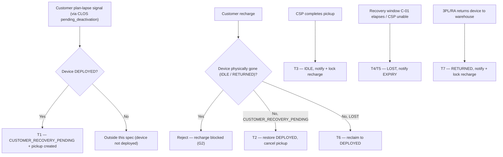

# Netbox Pickup — Customer-Driven Creation & Recharge Lock

*Who starts a pickup, and when recharge dies.*

| | | | |
|---|---|---|---|
| **Owner** — Jaivin Prajapati (PM) | **Reviewer** — [Eng lead — TBD] ⚠️ *GENERATED — review* | **Status** — Draft | **Sign-off** — Pending |
| **Version** — v0.2 · 2026-07-23 | **Consulted — Customer App** — [name] ⚠️ *GENERATED — review* | **Consulted — Connection lifecycle (CLOS)** — [name] ⚠️ *GENERATED — review* | **Consulted — Device custody (ACS/TAS)** — [name] ⚠️ *GENERATED — review* |

> **ID system:** G-n guardrails (§1) · R-n rules (§2) · T-n transitions (§3b, canon) · C-nn config (§5) · MQ-n measurement (§6) · AC-GROUP-n acceptance criteria (§7). §3b is canon — if any statement disagrees with it, §3b wins. This document states **what and why**; system decomposition, schemas, retry mechanics and instrumentation design belong to the implementer. This PRD is shared with both the **CSP** and **customer-app** teams.

---

## 1. Objective & Definition of Success

**Objective.** When a customer's plan lapses, their netbox is recovered on the **customer system's own plan-lapse signal** — sent by the customer app for **every** lapse scenario — instead of a delayed ISP-window timer; and once that device has been **picked up** or **returned to the warehouse**, the customer can **no longer recharge**, because there is no device to serve.

**Boundary.** This spec governs **(a)** how a netbox pickup is *created* — the trigger moves off a CSP-internal timer and onto the customer plan-lapse signal — and **(b)** the *handshakes ACS owes the customer system* when a device's custody changes (notify + recharge lock + a **refund-eligibility signal** whenever the device passes from the customer to CSP/warehouse). The **refund amount and its execution stay in the customer system** (R6); the recharge block is realised operationally as **archiving the customer**, whose full scope is an OPEN stub (see below). It **leaves unchanged**: the customer-initiated deactivation path (customer → CLOS `pending_deactivation` → ACS, AC-REG-1); the recharge-restoration chain (Customer → CRV → CAEOS → CLOS → ACS, AC-REG-2); the TAS pickup-task mechanics — assignment, verification, threshold timers (AC-REG-3); the recovery window itself (C-01); and the internal mechanics of warehouse return (governed by the device-warehouse-return spec — RETURNED appears here only for its notify + lock side-effect). It **removes** the CLOS **P76 timer** as a pickup-creation trigger. This is an **interim** architecture: the full segregation of CLOS / CAEOS / ACS roles is deferred to the future Customer OS.

### Guardrails — promises that hold on every path

| ID | Guardrail | One line | Anchors |
|---|---|---|---|
| G1 | **No self-created pickup** | Every pickup originates from the customer plan-lapse signal; ACS never self-initiates one — no timer, no P76, no fallback. | R1 · T1 · AC-CREATE-2 · AC-INV-1 · MQ-3 |
| G2 | **Recharge lock on recovery** | Once a device is IDLE or RETURNED, recharge is blocked for that customer — real-time and permanent; it never lifts. | R3 · R5 · T3 · T7 · AC-PICKUP-2 · AC-RETURN-2 · AC-INV-2 · MQ-4 · C-02 |
| G3 | **Recharge preserved with custody** | While a device is still with the customer (DEPLOYED, CUSTOMER_RECOVERY_PENDING, LOST), recharge is always honoured and wins over an open pickup. | R2 · R4 · T2 · T6 · AC-RECHARGE-1 · AC-EXPIRY-2 · MQ-2 |
| G4 | **Refund on handover** | Whenever a device passes from the customer to CSP/warehouse (into IDLE, or into RETURNED from a customer-holding state), the customer system is signalled that the customer is refund-eligible; amount and execution are the customer system's. | R3c · R5c · T3 · T7 · AC-REFUND-1 · AC-REFUND-2 · MQ-6 |

### Success metrics

| ID | Metric | Baseline | Target | Source |
|---|---|---|---|---|
| M1 | Customer plan-lapse signals that ACS executes into a created pickup (creation reliability across `lapse → event → CRP → nbrec`). | n/a — new reconciliation ⚠️ *GENERATED — review* | ≥ 99% ⚠️ *GENERATED — review* | MQ-1 |

**Invariant (not a metric):** **G1** pickups created without an originating customer signal = **0**, zero tolerance. Monitored continuously via MQ-3.
**Invariant (not a metric):** **G2** recharges that succeed for a customer whose device is IDLE/RETURNED = **0**, zero tolerance. Monitored continuously via MQ-4.

### Archiving a customer — OPEN (stub)

> **STUB — to be defined by Jaivin Prajapati + Saurabh Jain.** The recharge block (G2) is realised operationally as **archiving the customer** (today's process). The **scope and boundaries of archiving** — what it entails beyond blocking recharge, exactly when it applies, and whether/how it can be reversed — are **OPEN** and outside this draft's settled scope. The G2 recharge-block outcome stands regardless; the broader archiving semantics are pending this discussion.

---

## 2. User Stories & Rules

| ID | Story | MUST | MUST NOT |
|---|---|---|---|
| R1 | As the **customer system**, when a customer's plan lapses, I want the netbox pickup created off *my* signal, so recovery tracks the customer's real plan rather than the ISP billing window. | **(a)** ACS creates CUSTOMER_RECOVERY_PENDING + a pickup upon the customer plan-lapse signal (delivered via CLOS `pending_deactivation`), for **every** lapse scenario. | Create a pickup from **any** CSP-internal trigger — no timer, no P76, no fallback (G1). |
| R2 | As a **customer whose device is still in my hands**, when I recharge, my service is restored and any pending pickup is stood down. | **(a)** On a recharge while the device is DEPLOYED, CUSTOMER_RECOVERY_PENDING or LOST, restore the device to DEPLOYED and cancel any open pickup (existing CRV→CAEOS→CLOS→ACS chain). | Block the recharge, or let a pickup proceed, while the device is still with the customer (G3). |
| R3 | As **Wiom**, when a CSP has physically recovered the device, the customer must not be able to pay for a device they no longer have. | **(a)** On device → IDLE, notify the customer system in real-time (C-02). **(b)** Cause recharge to be blocked for that customer immediately and permanently. **(c)** In the same handshake, signal that the customer is eligible for a security refund — amount and execution are the customer system's (R6). | Allow any recharge to succeed once the device is IDLE (G2). |
| R4 | As **Wiom**, when a pickup expires unrecovered, the **customer system** is informed, while the customer may still reclaim by recharging (the device is still with them). *(The notification target is the customer **system**, not the end customer — this spec makes no claim about end-customer messaging.)* | **(a)** On device → LOST, notify the customer system (EXPIRY) — informational. | Block recharge on LOST (G3). |
| R5 | As **Wiom**, when a device is returned to the warehouse by 3PL/RA (or handed back to a CSP), the customer must not be able to pay for it. | **(a)** On device → RETURNED (from any holding state), notify the customer system in real-time (C-02). **(b)** Cause recharge to be blocked immediately and permanently. **(c)** When the device entered RETURNED from a customer-holding state (DEPLOYED / CUSTOMER_RECOVERY_PENDING / LOST), signal that the customer is refund-eligible (R6) — not re-signalled on an IDLE→RETURNED move. | Allow any recharge to succeed once the device is RETURNED (G2). |
| R6 | As **Wiom**, the security-refund amount stays computed by the customer system — unchanged, except that recovery type no longer affects it. | **(a)** The customer system issues a **full refund** with no recovery-type deduction. | Apply the former "returned to CSP office by customer" vs "picked up from the customer's house (₹50 deduction)" bifurcation — **removed**, because the new recovery flow is silent on the type of asset recovery. |

> **Note on mechanism (R3b/R5b):** whether ACS sends an explicit "block recharge" instruction or emits the custody-change event for the customer system to act on is the **implementer's** decision. Product's requirement is only the *outcome*: no recharge succeeds once the device is IDLE/RETURNED.

---

## 3. System Behaviour

### System flow chart

### 3a. Trigger routing table

| Trigger | Order | Check | Route |
|---|---|---|---|
| Customer plan-lapse signal (via CLOS `pending_deactivation`) | 1 | Device is DEPLOYED | T1 |
| | 2 | Otherwise | Outside this spec (device not deployed) |
| Customer recharge | 1 | Device is IDLE or RETURNED | **Reject — recharge blocked (G2)** |
| | 2 | Device is CUSTOMER_RECOVERY_PENDING | T2 |
| | 3 | Device is LOST | T6 |
| | 4 | Device is DEPLOYED | Normal recharge — outside this spec |
| CSP completes pickup | 1 | — | T3 |
| Recovery window elapses, or CSP reports unable | 1 | — | T4 / T5 |
| 3PL/RA returns device to warehouse | 1 | — | T7 |

**Precedence — recharge vs pickup:** if the device is **physically gone** (IDLE or RETURNED), a recharge is **rejected/blocked** — the recovered/returned state wins (G2, AC-INV-2). In **every other** state (DEPLOYED, CUSTOMER_RECOVERY_PENDING, LOST) the **recharge wins**: it is honoured and cancels any open pickup (T2/T6, AC-RECHARGE-1/2). A pickup-creation signal and a recharge landing together resolve to the recharge (device stays with the customer, no pickup) (AC-RECHARGE-3). A **blocked recharge is not accepted — no payment is taken**, so there is no held money and no refund path.

### 3b. State transition table — canon

Lifecycle of a **netbox device under recovery** — the state a deployed device enters when the customer system signals a lapse, through recovery (IDLE), expiry (LOST) or warehouse return (RETURNED). The device's normal deployed life, the customer's plan/recharge lifecycle, and the internal mechanics of warehouse return are governed **outside** this spec.

| ID | From | Action / Trigger | Rule / Check | To | Side-effects |
|---|---|---|---|---|---|
| T1 | DEPLOYED | Customer plan-lapse signal (via CLOS `pending_deactivation`) | Device is DEPLOYED | CUSTOMER_RECOVERY_PENDING | Pickup created in TAS (R1a). Originates only from the customer signal — no CSP-internal creation (G1). |
| T2 | CUSTOMER_RECOVERY_PENDING | Customer recharge (CRV→CAEOS→CLOS rescue) | — | DEPLOYED | Open pickup cancelled; service restored (R2a, G3). |
| T3 | CUSTOMER_RECOVERY_PENDING | CSP completes the pickup (device physically recovered) | — | IDLE | Customer system notified DEVICE_PICKUP in real-time (R3a, C-02); recharge blocked for that customer, permanent (R3b, G2); customer signalled refund-eligible — amount & execution customer-side (R3c, G4, R6). |
| T4 | CUSTOMER_RECOVERY_PENDING | CSP reports unable to recover (before C-01) | — | LOST | Customer system notified EXPIRY — informational (R4a); recharge stays open (G3). |
| T5 | CUSTOMER_RECOVERY_PENDING | Recovery window (C-01) elapses | — | LOST | Customer system notified EXPIRY (R4a); recharge stays open (G3). |
| T6 | LOST | Customer recharge (rescue) | — | DEPLOYED | Device reclaimed; service restored (R2a, G3). |
| T7 | DEPLOYED · CUSTOMER_RECOVERY_PENDING · LOST · IDLE | 3PL/RA returns device to warehouse, or customer hands the device back to a CSP | — | RETURNED | Customer system notified in real-time (R5a, C-02); recharge blocked, permanent (R5b, G2); when entered from a customer-holding state (DEPLOYED/CUSTOMER_RECOVERY_PENDING/LOST) the customer is signalled refund-eligible (R5c, G4) — the IDLE→RETURNED move does not re-signal. Warehouse-return mechanics — and CSP acceptance of a customer-returned device, a separate task whose completion emits the refund signal — are outside this spec. |

*Terminal-for-this-spec states:* IDLE and RETURNED are recharge-locked; a re-dispatch of a RETURNED device to another CSP is a supply action for a different customer and is outside this spec. LOST is non-terminal (T6 reclaim, or T7 return).

---

## 4. UX Requirements

**N/A — backend-architecture spec.** This spec defines backend behaviour and system-to-system handshakes only; there is **no customer-app UX** and **no CSP-app change** in scope. Any customer-facing treatment of the recharge-lock state (e.g. what a blocked customer sees) is owned by the customer-app team and is **out of scope here**.

---

## 5. Configurability

| ID | Parameter | Default | Range | Who changes it |
|---|---|---|---|---|
| C-01 | Recovery window (CUSTOMER_RECOVERY_PENDING → LOST, T4/T5) — the existing `P_RECOVERY_MAX_WINDOW` | 21 days ⚠️ *GENERATED — review (from current code, not restated in interview)* | Unchanged by this spec | PM + Eng |
| C-02 | Recharge-block / customer-notification latency on IDLE & RETURNED (T3, T7) | Real-time — block effective before any recharge attempt can succeed | Real-time (no tolerance window) | Eng |

**Customer-side (out of scope, referenced):** the customer system's lapse threshold — *plan expired + 15 days grace* — is the signal that drives T1 creation. It is owned and configured by the **customer-app team**, not by this spec; it appears here only as the origin of MQ-1's reconciliation.

**Interaction note (C-01 × C-02):** while a device is in CUSTOMER_RECOVERY_PENDING (up to C-01), recharge remains **open** (G3). C-02's real-time lock applies **only** at the instant the device becomes IDLE or RETURNED — there is no window in which a recovered device is still rechargeable.

---

## 6. Measurement

| ID | The system must be able to answer… | Feeds |
|---|---|---|
| MQ-1 | For each customer lapse (plan expired + grace, in the customer system): was the lapse signal delivered to CSP, and was a pickup created? — the `lapse → event → CUSTOMER_RECOVERY_PENDING → nbrec` reconciliation, with drops located at each hop. | M1 · R1 · G1 |
| MQ-2 | For each customer recharge on a device still with the customer: was the device restored and any open pickup cancelled? — the recharge reconciliation. | R2 · G3 |
| MQ-3 | Was **any** pickup created in CSP without an originating customer signal? | G1 invariant · AC-INV-1 |
| MQ-4 | Did **any** recharge succeed for a customer whose device was IDLE or RETURNED? | G2 invariant · AC-INV-2 |
| MQ-5 | For each device reaching IDLE or RETURNED: was the recharge block effective in real-time (C-02)? | C-02 · G2 |
| MQ-6 | For each device that passed from the customer to CSP/warehouse (entry to IDLE, or entry to RETURNED from a customer-holding state): was the customer system signalled refund-eligible exactly once? | G4 · R3c · R5c |

---

## 7. Acceptance Criteria

### CREATE — Pickup creation (T1)

| AC | Given / When / Then | Verifies | Status |
|---|---|---|---|
| AC-CREATE-1 | **Given** a DEPLOYED device, **When** the customer plan-lapse signal arrives via CLOS `pending_deactivation`, **Then** the device moves to CUSTOMER_RECOVERY_PENDING and a pickup is created in TAS. | R1a · T1 | Settled |
| AC-CREATE-2 | **Given** no customer plan-lapse signal, **When** any CSP-internal condition occurs (a timer firing, a pause window elapsing, the former P76 path), **Then** no pickup is created. | R1 MUST NOT · G1 | Settled |
| AC-CREATE-3 | **Given** a device already in CUSTOMER_RECOVERY_PENDING, **When** a duplicate customer plan-lapse signal arrives, **Then** no second pickup is created. ⚠️ *GENERATED — review* | R1a · G1 | OPEN |

### RECHARGE — Recharge while device is with the customer (T2, T6)

| AC | Given / When / Then | Verifies | Status |
|---|---|---|---|
| AC-RECHARGE-1 | **Given** a device in CUSTOMER_RECOVERY_PENDING with an open pickup, **When** the customer recharges, **Then** the device returns to DEPLOYED and the open pickup is cancelled — the recharge is never blocked while the device is with the customer. | R2a · R2 MUST NOT · T2 · G3 | Settled |
| AC-RECHARGE-2 | **Given** a device in LOST, **When** the customer recharges, **Then** the device returns to DEPLOYED (reclaim). | R2a · T6 · G3 | Settled |
| AC-RECHARGE-3 | **Given** a device in CUSTOMER_RECOVERY_PENDING, **When** a recharge and a pickup-creation signal land together, **Then** the recharge is honoured and no pickup remains. | precedence (§3a) · G3 | Settled |

### PICKUP — Device recovered (T3)

| AC | Given / When / Then | Verifies | Status |
|---|---|---|---|
| AC-PICKUP-1 | **Given** a device in CUSTOMER_RECOVERY_PENDING, **When** the CSP completes the pickup, **Then** the device moves to IDLE, the customer system is notified (DEVICE_PICKUP) within C-02, and recharge is blocked for that customer. | R3a · R3b · T3 · C-02 · G2 | Settled |
| AC-PICKUP-2 | **Given** a device in IDLE, **When** the customer attempts to recharge, **Then** the recharge does not succeed (now or ever). | R3 MUST NOT · G2 | Settled |

### EXPIRY — Pickup expired unrecovered (T4, T5)

| AC | Given / When / Then | Verifies | Status |
|---|---|---|---|
| AC-EXPIRY-1 | **Given** a device in CUSTOMER_RECOVERY_PENDING, **When** the recovery window (C-01) elapses or the CSP reports unable, **Then** the device moves to LOST and the customer system is notified (EXPIRY). | R4a · T4 · T5 | Settled |
| AC-EXPIRY-2 | **Given** a device in LOST, **When** the customer recharges, **Then** the recharge succeeds and the device is reclaimed — it is **not** blocked. | R4 MUST NOT · T6 · G3 | Settled |

### RETURN — Warehouse return (T7)

| AC | Given / When / Then | Verifies | Status |
|---|---|---|---|
| AC-RETURN-1 | **Given** a device in any holding state (DEPLOYED / CUSTOMER_RECOVERY_PENDING / LOST / IDLE), **When** 3PL/RA returns it to the warehouse, **Then** the device moves to RETURNED, the customer system is notified within C-02, and recharge is blocked. | R5a · R5b · T7 · C-02 · G2 | Settled |
| AC-RETURN-2 | **Given** a device in RETURNED, **When** the customer attempts to recharge, **Then** the recharge does not succeed (now or ever). | R5 MUST NOT · G2 | Settled |

### REFUND — Security-refund handshake (T3, T7)

| AC | Given / When / Then | Verifies | Status |
|---|---|---|---|
| AC-REFUND-1 | **Given** a device in CUSTOMER_RECOVERY_PENDING, **When** the CSP completes the pickup (→ IDLE), **Then** the customer system is signalled that the customer is refund-eligible, within C-02. | R3c · T3 · G4 · C-02 | Settled |
| AC-REFUND-2 | **Given** a device in a customer-holding state (DEPLOYED / CUSTOMER_RECOVERY_PENDING / LOST), **When** it is returned to the warehouse or handed back to a CSP (→ RETURNED), **Then** the customer system is signalled refund-eligible, within C-02. | R5c · T7 · G4 · C-02 | Settled |
| AC-REFUND-3 | **Given** a recovered or returned device, **When** the customer system computes the refund, **Then** a full refund is issued with no recovery-type deduction (the former ₹50 office-vs-pickup bifurcation is not applied). | R6a · R6 MUST NOT | Settled |
| AC-REFUND-4 | **Given** a device in LOST, **When** the customer returns it to CSP/3PL (→ RETURNED), **Then** the customer system is signalled refund-eligible (a recharge instead reclaims the device with no refund — AC-RECHARGE-2). | R5c · T7 · G4 | Settled |
| AC-REFUND-5 | **Given** a device already in IDLE, **When** it is moved to the warehouse (IDLE → RETURNED), **Then** the refund-eligibility signal is not sent a second time. | R5c · T7 · G4 | Settled |

### INV — Cross-cutting invariants

| AC | Given / When / Then | Verifies | Status |
|---|---|---|---|
| AC-INV-1 | **Given** any path, **Then** no pickup exists in CSP that was not triggered by an originating customer plan-lapse signal. | G1 · MQ-3 | Settled |
| AC-INV-2 | **Given** any customer whose device is IDLE or RETURNED, **Then** no recharge ever succeeds for that customer on that device. | G2 · MQ-4 | Settled |

### REG — Regression (Boundary, §1)

| AC | Given / When / Then | Verifies | Status |
|---|---|---|---|
| AC-REG-1 | **Given** a customer-initiated deactivation, **When** it flows customer → CLOS `pending_deactivation` → ACS, **Then** behaviour is exactly as today — only the P76 auto-trigger is removed. | Boundary | Settled |
| AC-REG-2 | **Given** a customer recharge, **When** it flows Customer → CRV → CAEOS → CLOS → ACS, **Then** the existing restoration chain is unchanged. | Boundary | Settled |
| AC-REG-3 | **Given** an open pickup, **When** it is assigned, worked and verified in TAS, **Then** the pickup-task mechanics and the C-01 recovery window are unchanged by this spec. | Boundary · C-01 | Settled |

---

## 8. Glossary

| Term | Meaning | Owner (domain) |
|---|---|---|
| Netbox pickup (PUT / NBREC) | **Canonical definition:** the recovery task created when a customer's netbox must be recovered. Created only from the customer plan-lapse signal (G1). All other mentions reference this. | Device custody |
| Plan-lapse signal | The customer-system signal (plan expired + grace) that triggers pickup creation (T1). Owned and timed by the customer app; ACS only executes it. | Customer App |
| CUSTOMER_RECOVERY_PENDING (CRP) | Device state: still with the customer, pickup open. Recharge remains available (G3). | Device custody (ACS) |
| IDLE | Device physically recovered into CSP custody — no longer with the customer. Recharge-locked (G2). | Device custody (ACS) |
| LOST | Pickup expired unrecovered; device still with the customer. Recharge stays open (reclaim, T6). | Device custody (ACS) |
| RETURNED | Device returned to the warehouse (3PL/RA) or handed back to a CSP. Recharge-locked (G2). Internal mechanics governed by the device-warehouse-return spec. | Device custody (ACS) |
| Security refund | The deposit refund a customer is owed once they hand the device back. **Amount and execution live in the customer system**; this spec only signals *eligibility* on handover (G4, R3c/R5c). | Customer App |
| Refund-eligibility signal | The signal ACS sends the customer system, alongside the custody change, when a device passes from the customer to CSP/warehouse — the customer is now owed a refund. | ACS → Customer App |
| Archiving a customer | Today's operational name for blocking a customer from recharging (G2). Full scope/boundaries are **OPEN** (§1 stub, pending Jaivin + Saurabh Jain). | — |
| P76 timer | The CLOS pause-duration timer that today auto-creates a pickup off the ISP pause window. **Removed** as a creation trigger by this spec. | Connection lifecycle (CLOS) |
| Recharge lock | The permanent, real-time block on a customer's recharge once their device is IDLE or RETURNED (G2, C-02). Never lifts. | — |
| CLOS | Connection lifecycle — internet-service status per the ISP recharge window. Carries the customer plan-lapse signal to ACS via `pending_deactivation`. | Connection lifecycle |
| CRV / CAEOS | The customer plan-mirror chain that carries a recharge back to ACS (Customer → CRV → CAEOS → CLOS → ACS). Unchanged by this spec. | Plan lifecycle |
| ACS | Asset custody — owns the device custody lifecycle in §3b; executes creation and the customer-system handshakes. | Device custody |
| TAS | Task allocation — owns the pickup task (assignment, verification). Mechanics unchanged by this spec. | Task allocation |

---

## 9. Notes for System Capabilities

| Capability | Needed by |
|---|---|
| Receive a customer plan-lapse signal and, when the device is DEPLOYED, create a pickup — and never self-initiate one. | T1 · R1 · G1 |
| While a device is with the customer, honour a recharge and cancel any open pickup. | T2 · T6 · R2 · G3 |
| Notify the customer system in real-time on device pickup (IDLE) and warehouse return (RETURNED), and cause recharge to be blocked permanently for that customer. | T3 · T7 · R3 · R5 · G2 · C-02 |
| Notify the customer system on expiry (LOST) without blocking recharge. | T4 · T5 · R4 |
| On the same handover handshake, signal the customer system that the customer is refund-eligible (amount & execution stay customer-side). | T3 · T7 · R3c · R5c · G4 |
| Answer the reconciliation and negative-check questions across the creation and recharge handshakes. | MQ-1 · MQ-2 · MQ-3 · MQ-4 · MQ-5 |

---

## Generated content for review

*The PRD is not sign-off-ready until every row here is confirmed (marker removed) or corrected.*

| Location | What was generated | Basis |
|---|---|---|
| Header — Reviewer, Consulted parties | Names left as placeholders | Not supplied in interview; needs the actual eng lead + consulted owners (Customer App, CLOS, ACS/TAS). |
| §1 M1 baseline & target (n/a / ≥99%) | Baseline "n/a — new reconciliation" and target ≥99% | Inferred; PM defined the *metric* (MQ-1 funnel) but not baseline/target numbers. |
| §5 C-01 value (21 days) | The recovery-window value | Taken from current code (`P_RECOVERY_MAX_WINDOW`); PM confirmed the window "stays" but did not restate the number — confirm it is unchanged and correct. |
| §3b entity name ("netbox device under recovery") | Framing of the canonical entity | Inferred from the interview; confirm this is the right lifecycle to make canon (vs. "the pickup"). |
| §7 AC phrasings (all "Settled") | Given/When/Then wording and status | Derived from the rules/transitions per the skill; confirm the negative/precedence ACs (AC-CREATE-2, AC-RECHARGE-3, AC-PICKUP-2, AC-RETURN-2) read the way you intend. |
| §1 objective — "no device to serve" ending | Final clause wording | You confirmed the objective "spot on"; this is my phrasing of the recharge-lock consequence — confirm tone. |
| §7 AC-CREATE-3 (idempotency) | Duplicate lapse signal on an already-CRP device → no second pickup | Added by the lint's scenario sweep; you did not state duplicate-signal behaviour — confirm this is right (vs. treating a duplicate as an error). Marked OPEN. |
| §1 Archiving stub | Archiving scope/boundaries left OPEN | Deliberate — pending your discussion with Saurabh Jain. |
| §2 R6 / §7 AC-REFUND-3 | Removal of the ₹50 recovery-type deduction → full refund | You stated it; this is a cross-pod change the customer team owns — confirm "all other amount logic stays" and who signs on the customer side. |
