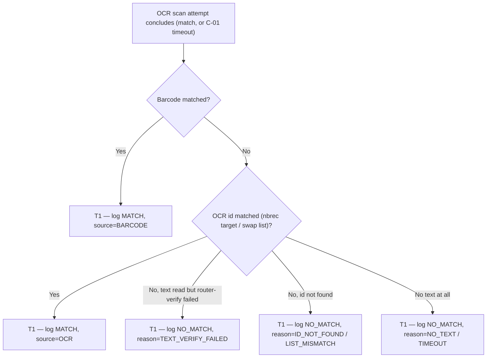

# Scanner Accuracy Logging — One Row per OCR Scan Attempt

*Measure how well the CSP-app scanners actually read device IDs.*

| | | | |
|---|---|---|---|
| **Owner** — Jaivin Prajapati (PM) | **Reviewer** — [Eng lead — TBD] ⚠️ *GENERATED — review* | **Status** — Draft | **Sign-off** — Pending |
| **Version** — v0.1 · 2026-07-23 | **Consulted — CSP App** — [name] ⚠️ *GENERATED — review* | **Consulted — Device custody (ACS)** — [name] ⚠️ *GENERATED — review* | **Consulted — Data/Analytics** — [name] ⚠️ *GENERATED — review* |

> **ID system:** G-n guardrails (§1) · R-n rules (§2) · T-n transitions (§3b, canon) · C-nn config (§5) · MQ-n measurement (§6) · AC-GROUP-n acceptance criteria (§7). §3b is canon. This document states **what and why**; where the log lives, the transport, the photo pipeline's internals and retention are the implementer's. Shared with the **CSP-app** and **ACS** teams.

---

## 1. Objective & Definition of Success

**Objective.** We can measure and improve the accuracy of the two CSP-app OCR scanners — the **netbox-pickup** scanner and the **swap** scanner — because **every scan attempt is logged** with what it read, what it should have read, and whether it matched, queryable in one place.

**Boundary.** This spec governs **logging only** — a write-only record persisted per OCR scan attempt, for **both** scanners, stored in **ACS**. It **leaves the scanners themselves completely unchanged**: the OCR/barcode logic, the match rules, the per-attempt timeout (C-01), the attempt limit (C-02), the retry UX and the fallbacks (manual-photo for nbrec, list-selection for swap) are all untouched. It logs **scan attempts only** — the fallback resolutions are **not** logged. The photo of each scanned frame reuses the app's **existing presigned-upload pipeline**; the log stores only a reference. **Retention, transport, and where the endpoint sits are engineering's** (not product decisions here).

### Guardrails — promises that hold on every path

| ID | Guardrail | One line | Anchors |
|---|---|---|---|
| G1 | **Non-intrusive** | Logging never changes, blocks, delays or fails a scan — a logging error is invisible to the scan flow. | R1 · T1 · AC-LOG-5 · MQ-6 |
| G2 | **One row per attempt** | Exactly one log row exists per OCR scan attempt (≤3 per scan session) — never duplicated, never dropped for a completed attempt. | R1 · T1 · AC-LOG-1 · AC-LOG-6 · MQ-6 |
| G3 | **Complete &amp; attributable** | Every logged attempt carries the full field set and a flow tag, so a match rate can be computed per flow and per read-source without gaps. | R2 · R3 · R4 · AC-LOG-2 · AC-LOG-3 · MQ-1 |

### Success metrics

| ID | Metric | Baseline | Target | Source |
|---|---|---|---|---|
| M1 | Scan attempts that produce a complete, attributable log row (logging coverage). | n/a — not currently measured (no scan logging exists) | ≥ 99% ⚠️ *GENERATED — review* | MQ-6 |
| M2 | Scanner match rate is **computable** per flow and per read-source (barcode vs OCR) — the capability this feature exists to create. | n/a — new capability | Capability live | MQ-1 |

**Invariant (not a metric):** **G1** scans affected by a logging failure = **0**, zero tolerance. Monitored via MQ-6.

---

## 2. User Stories & Rules

| ID | Story | MUST | MUST NOT |
|---|---|---|---|
| R1 | As the **product/analytics owner**, I want every OCR scan attempt in both flows logged, so scanner accuracy is measurable instead of guessed. | **(a)** Write **one** log row per concluded scan attempt (both flows), carrying the full field set (§5). **(b)** Do it asynchronously / fire-and-forget. | **(a)** Alter, block, delay or fail the scan because of logging (G1). **(b)** Log the fallback resolutions (manual-photo / list-selection) — scan attempts only. |
| R2 | As the analyst, for a **netbox-pickup** attempt I need to see what it was supposed to match. | **(a)** Record the **expected device id** (the nbrec target) and the in-analyzer match result. | Log a swap attempt with an expected device id (swap has none). |
| R3 | As the analyst, for a **swap** attempt I need the real match outcome, which is decided **after** the read. | **(a)** Record the match result as decided **downstream** against the CSP's IDLE/CUSTODIED list (the analyzer reads with no target); record the candidate-list size. | Record a swap match at OCR-read time as if the analyzer matched a target (it does not). |
| R4 | As the analyst, I need to root-cause failures, not just count them. | **(a)** Record: all OCR text read, barcode text read, the id the scanner extracted, the read-source (barcode / OCR / none), the router-text-verify result, and the no-match reason. | Reduce a no-match to a bare boolean with no reason or read-back. |
| R5 | As the analyst, I need the image that produced each read. | **(a)** Capture a representative frame of the attempt and store its reference (via the existing upload pipeline). | Store the image bytes in the log record itself (store a reference). |

---

## 3. System Behaviour

### System flow chart

### 3a. Trigger routing table

| Trigger | Order | Check | Route |
|---|---|---|---|
| A scan attempt concludes (match, or C-01 timeout) | 1 | Barcode matched the target/list | T1 (MATCH, source=BARCODE) |
| | 2 | OCR-read id matched (nbrec target, or swap IDLE/CUSTODIED list) | T1 (MATCH, source=OCR) |
| | 3 | Text read but `router_text_verified` = false | T1 (NO_MATCH, reason=TEXT_VERIFY_FAILED) |
| | 4 | An id was read but did not match | T1 (NO_MATCH, reason=ID_NOT_FOUND for nbrec / LIST_MISMATCH for swap) |
| | 5 | No usable text before timeout | T1 (NO_MATCH, reason=NO_TEXT or TIMEOUT) |
| The scan session ends without a match (3 attempts used) → fallback taken | — | — | Outside this spec (fallbacks are not logged, R1b) |

**Precedence:** barcode match is evaluated before OCR match (the analyzer prefers barcode); the recorded `match_source` reflects whichever resolved. For swap, the MATCH vs NO_MATCH is set at the **downstream list check**, not at OCR read (R3).

### 3b. State transition table — canon

Lifecycle of a **scan-attempt log** — a write-once record created when one OCR scan attempt concludes. It has no lifecycle beyond creation; there is no update or delete in this spec.

| ID | From | Action / Trigger | Rule / Check | To | Side-effects |
|---|---|---|---|---|---|
| T1 | — | A scan attempt concludes (match or C-01 timeout) | Attempt belongs to the nbrec or swap flow | Logged | One row written with the full field set (§5), the flow tag, attempt number and session id (R1a, G2, G3); a representative frame captured and referenced via the existing upload pipeline (R5); write is async and never affects the scan (R1b, G1). Fallback resolutions produce **no** row (R1b). |

*No other states.* The scanner's own attempt/retry/fallback lifecycle is unchanged and out of scope.

---

## 4. UX Requirements

**N/A — instrumentation only.** No user-visible change. The scanner UX (camera, retry modal, fallback to manual-photo / list-selection) is explicitly unchanged (§1 Boundary).

---

## 5. Configurability & Tracked Data

**Configurable values (existing, referenced — unchanged by this spec):**

| ID | Parameter | Default | Range | Who changes it |
|---|---|---|---|---|
| C-01 | Per-attempt scan timeout (defines when an attempt "concludes") | Existing — engineering-owned | Unchanged by this spec | Engineering |
| C-02 | Max scan attempts per session (before fallback) | Existing — engineering-owned | Unchanged by this spec | Engineering |

**Tracked data — one record per scan attempt** (business meaning; field names, types and storage are the implementer's):

| Field | Meaning | Notes |
|---|---|---|
| Flow | Which scanner: **NBREC_PICKUP** or **NETBOX_SWAP**. | R1 · G3 |
| Context id (+ type) | The nbrec candidate/pickup id (nbrec) or the swap task id (swap). | R2 · R3 |
| Scan-session id | Groups the ≤ C-02 attempts of one scan instance. | G2 |
| Attempt number | 1…C-02 within the session. | G2 |
| Expected device id | The id the scanner was told to match. **Present for nbrec; absent for swap.** | R2 |
| Device id read | The id the scanner actually extracted (present even on no-match). | R4 |
| Match result | **MATCH** / **NO_MATCH**. For swap, set at the downstream list check (R3). | G3 |
| Match source | **BARCODE** / **OCR** / **NONE**. | R4 |
| No-match reason | NO_TEXT · ID_NOT_FOUND · LIST_MISMATCH · TEXT_VERIFY_FAILED · TIMEOUT (null on match). | R4 |
| Router-text-verified | Whether the anti-fraud router-text check passed. | R4 |
| OCR text | All text the scanner read this attempt. | R4 |
| Barcode text | Barcode value(s) read this attempt. | R4 |
| Photo reference | Reference to the captured frame (via the existing upload pipeline). | R5 |
| Swap candidate-list size | Count of IDLE/CUSTODIED devices the read was checked against (swap only). | R3 |
| CSP id | The CSP running the scan. | MQ-5 |
| App version · device model · OS version | Client fingerprint, for accuracy triage by hardware/build. | MQ-5 |
| Scanned-at · logged-at | Client attempt time · server write time. | — |

---

## 6. Measurement

| ID | The system must be able to answer… | Feeds |
|---|---|---|
| MQ-1 | Per flow, the scan **match rate** (MATCH / total attempts), split by **match source** (barcode vs OCR). | M1 · M2 · G3 |
| MQ-2 | Of NO_MATCH attempts, the distribution by **no-match reason** — where the scanner is failing. | R4 |
| MQ-3 | Per flow, how many **attempts to reach a match**, and how often a session exhausts C-02 and falls back. | R1 |
| MQ-4 | Suspected **false-success**: MATCHes where the read id ≠ expected (nbrec) or `router_text_verified` looks anomalous — the pattern behind the earlier scanner defect. | R4 |
| MQ-5 | Match rate sliced by **device model / app version / CSP** — is accuracy hardware- or build-specific? | R4 |
| MQ-6 | Were **all** concluded attempts logged (coverage), and did any scan fail or slow because of logging? | M1 · G1 · G2 |

---

## 7. Acceptance Criteria

### LOG — Scan-attempt logging (T1)

| AC | Given / When / Then | Verifies | Status |
|---|---|---|---|
| AC-LOG-1 | **Given** an nbrec or swap scan session, **When** an OCR attempt concludes (match or C-01 timeout), **Then** exactly one log row is written for that attempt, tagged with the flow, session id and attempt number. | R1a · T1 · G2 | Settled |
| AC-LOG-2 | **Given** a **netbox-pickup** attempt, **When** it is logged, **Then** the row carries the expected device id, the id read, the match result, match source, router-text-verified, no-match reason, OCR text, barcode text and a photo reference. | R2a · R4a · G3 | Settled |
| AC-LOG-3 | **Given** a **swap** attempt, **When** it is logged, **Then** the row has **no** expected device id, carries the candidate-list size, and its match result reflects the **downstream** list check (not the OCR-read moment). | R3a · G3 | Settled |
| AC-LOG-4 | **Given** any attempt, **When** its frame is captured, **Then** the log stores a **reference** to the uploaded image, never the bytes. | R5a | Settled |
| AC-LOG-5 | **Given** the log write fails or is slow (endpoint down, upload fails), **When** the customer/CSP scans, **Then** the scan proceeds and resolves exactly as if logging were absent — no error, no delay. | R1 MUST NOT(a) · G1 | Settled |
| AC-LOG-6 | **Given** a scan session of N concluded attempts, **When** logging completes, **Then** there are exactly N rows for that session — no duplicates, none missing. | R1a · G2 | Settled |
| AC-LOG-7 | **Given** a session that exhausts C-02 attempts and falls back (manual-photo / list-selection), **When** the fallback resolves, **Then** **no** additional log row is written for the fallback. | R1 MUST NOT(b) | Settled |

---

## 8. Glossary

| Term | Meaning | Owner (domain) |
|---|---|---|
| Scan attempt | **Canonical definition:** one OCR read cycle that concludes in a match or a C-01 timeout. Up to C-02 attempts form a scan session. One log row per attempt. | CSP App |
| Scan session | The set of attempts for one scan instance (one pickup, or one swap new-device read), ending in a match or a fallback. | CSP App |
| netbox-pickup scanner | The scanner in the NBREC pickup flow: reads the device, matches against the **pickup's expected device id**; on reaching the attempt limit (C-02) → manual-photo upload. | CSP App / ACS |
| swap scanner | The scanner in the netbox-swap flow: reads a device, matches (downstream) against the CSP's **IDLE/CUSTODIED list**; on reaching the attempt limit (C-02) → pick from list. Shares the same OCR core as the pickup scanner. | CSP App / ACS |
| Match source | Whether the resolved read came from **barcode** (reliable) or **OCR** (best-effort). Accuracy analysis separates the two. | — |
| Router-text-verified | The anti-fraud check that the read text looks like a real router label; a MATCH that passed this yet read the wrong id is the false-success pattern (MQ-4). | CSP App |
| No-match reason | Why an attempt did not match: NO_TEXT · ID_NOT_FOUND · LIST_MISMATCH · TEXT_VERIFY_FAILED · TIMEOUT. | — |

---

## 9. Notes for System Capabilities

| Capability | Needed by |
|---|---|
| At the shared OCR analyzer, capture per concluded attempt: read text, barcode text, extracted id, match source, router-text-verify result, and (per flow) the match outcome. | R2 · R3 · R4 · T1 |
| Capture a representative frame per attempt and store it via the existing upload pipeline, keeping only a reference in the log. | R5 · T1 |
| Persist one queryable record per attempt in ACS, asynchronously, so a logging failure never affects the scan. | R1 · G1 · G2 · T1 |
| Answer the accuracy questions across flow, match source, no-match reason, false-success and hardware/build. | MQ-1 · MQ-2 · MQ-3 · MQ-4 · MQ-5 · MQ-6 |

---

## Generated content for review

*Not sign-off-ready until every row is confirmed or corrected.*

| Location | What was generated | Basis |
|---|---|---|
| Header — Reviewer, Consulted | Placeholders | Need the eng lead + consulted owners (CSP App, ACS, Data/Analytics). |
| §1 M1 target (≥99%) | Coverage target | Inferred; confirm the acceptable logging-coverage target. |
| §3b entity ("scan-attempt log", write-only) | Canonical entity framing | This is a logging feature with no real state machine; confirm the write-once framing is acceptable as §3b canon. |
| §5 C-01 / C-02 | Existing scanner timing — engineering-owned | Product does not define these technical values; referenced as existing, unchanged. |
